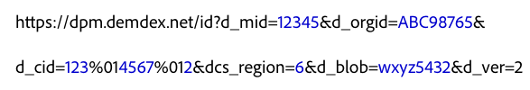

# 与 Experience Cloud ID 服务的直接集成 {#direct-integration-with-the-experience-cloud-id-service}

通过此实施，客户可以在无法接受或使用我们的 JavaScript 或 SDK 代码的设备上使用 ID 服务。这包括游戏控制台、智能电视或其他启用 Internet 的设备。有关语法、代码示例和定义，请参阅此部分内容。

## 语法{#section-a4754afec5ad40b6be00d6f1011d68bb}

无法使用 VisitorAPI.js 或 SDK 代码库的设备可以直接调用 ID 服务所使用的数据收集服务器 (DCS)。为此，您需要调用 `dpm.demdex.net`，并将请求设置为如下所示的格式。*斜体*表示变量占位符。


在此语法示例中，`d_` 前缀用于将调用中的键值对标识为系统级别的变量。您可以将许多 `d_` 参数传递到 ID 服务，但请重点关注上述代码中显示的键值对。有关其他变量的更多信息，请参阅 [DCS API 调用支持的属性](https://marketing.adobe.com/resources/help/zh_CN/aam/dcs-keys.html)。

ID 服务支持 HTTP 和 HTTPS 调用。使用 HTTPS 可传递来自安全页面的数据。

## 示例请求 {#section-26302b8851704888b6f8e6b2071bcdb0}

您的请求可能与下面显示的示例类似。长变量已缩短。



## 示例响应 {#section-89bc103b3e9e4a8b98e74c32897b1200}

ID 服务会在 JSON 对象中返回数据，如下所示。您的响应可能会有所不同。

```js
{
     "d_mid":"12345",
     "dcs_region":"6",
     "id_sync_ttl":"604800",
     "d_blob":"wxyz5432"
}
```

## 定义的请求和响应参数 {#section-4a9912b545364dc4acad4f1ea5ec641d}

**请求参数**

<table id="table_C8FFA89AB74E4E31A6926CDE5CD54217"> 
 <thead> 
  <tr> 
   <th colname="col1" class="entry"> 参数 </th> 
   <th colname="col2" class="entry"> 描述 </th> 
  </tr> 
 </thead>
 <tbody> 
  <tr> 
   <td colname="col1"> <p> <span class="codeph"> dpm.demdex.net</span> </p> </td> 
   <td colname="col2"> <p>由 <span class="keyword">Adobe</span> 控制的旧版域。请参阅<a href="https://marketing.adobe.com/resources/help/zh_CN/aam/demdex-calls.html" format="https" scope="external">了解 Demdex 域调用</a>。 </p> </td> 
  </tr> 
  <tr> 
   <td colname="col1"> <p> <span class="codeph"> d_mid</span> </p> </td> 
   <td colname="col2"> <p>Experience Cloud 访客 ID。请参阅 <a href="../introduction/cookies.md" format="dita" scope="local"> Cookie 和 Experience Cloud ID 服务</a>. </p> </td> 
  </tr> 
  <tr> 
   <td colname="col1"> <p> <span class="codeph"> d_orgid</span> </p> </td> 
   <td colname="col2"> <p>您的 Experience Cloud 组织 ID。要获取有关如何查找此 ID 的帮助，请参阅 <a href="../reference/requirements.md" format="dita" scope="local"> Experience Cloud ID 服务的要求</a>. </p> </td> 
  </tr> 
  <tr> 
   <td colname="col1"> <p> <span class="codeph"> d_cid</span> </p> </td> 
   <td colname="col2"> <p>一个可选参数，用于将数据提供程序 ID (DPID)、独特用户 ID (DPUUID) 和<a href="../reference/authenticated-state.md" format="dita" scope="local">身份验证状态 ID</a> 传递给 ID 服务。如代码示例中所示，DPID 和 DPUUID 使用非打印控制字符 <span class="codeph">%01</span> 来分隔。 </p> <p> <b>DPID 和 DPUUID</b> </p> <p>在 <span class="codeph">d_cid</span> 参数中，将每个相关的 DPID 和 DPUUID 组合分配到同一个 <span class="codeph">d_cid</span> 参数。这样，您便可以在一个请求中返回多组 ID。此外，需使用非打印控制字符 <span class="codeph">%01</span> 来分隔 DPID、DPUUID 和可选身份验证标记。在以下示例中，提供程序 ID 和用户 ID 均以<b>粗体</b>文本突出显示。 </p> 
    <ul id="ul_2E19D837296B40E9ACD096495CF711C5"> 
     <li id="li_5B94B057654440B99B989BA60E4ED053">语法：<span class="codeph">...d_cid=DPID%01DPUUID%01authentication state...</span> </li> 
     <li id="li_B07833EF51D54F088574B7B7F9FB841A">示例：<span class="codeph">...d_cid=123%01456%011...</span> </li> 
    </ul> <p> <b>身份验证状态</b> </p> <p>这是 <span class="codeph">d_cid</span> 参数中的一个可选 ID。此 ID 以整数形式表示，用于根据用户的身份验证状态来标识用户，如下所示： </p> 
    <ul id="ul_E2B36922B11C4AA2A9016B6E2DC9EDAA"> 
     <li id="li_31C018E3F9514B938C73EF40C436715F"> <span class="codeph">0</span>（未知） </li> 
     <li id="li_1F125C3879324C2F8EF4613C0ECB5F02"> <span class="codeph">1</span>（已通过身份验证） </li> 
     <li id="li_EF6792D0115D407485079D5D7480D965"> <span class="codeph">2</span>（已注销） </li> 
    </ul> <p>要指定身份验证状态，您需要在用户 ID (UUID) 变量之后设置此标记。需使用非打印控制字符 <span class="codeph">%01</span> 来分隔 UUID 和身份验证标记。在以下示例中，身份验证 ID 以<b>粗体</b>文本突出显示。 </p> <p>语法：<span class="codeph">...d_cid=DPID%01DPUUID%01authentication state</span> </p> <p>示例： </p> 
    <ul id="ul_4C1054CE860A4D9C8DD85C2A8020C47F"> 
     <li id="li_AD4000BF3E0146C0BD37B1EC513EC314">未知：<span class="codeph">...d_cid=123%01456%010...</span> </li> 
     <li id="li_B037D424AADA4D41BF29381A9602AE61">已通过身份验证：<span class="codeph">...d_cid=123%01456%011...</span> </li> 
     <li id="li_0410FCB9E60D4DD08E7898D814E1C3C9">已注销：<span class="codeph">...d_cid=123%01456%012...</span> </li> 
    </ul> </td> 
  </tr> 
  <tr> 
   <td colname="col1"> <p> <span class="codeph"> dcs_region</span> </p> </td> 
   <td colname="col2"> <p>ID 服务是一个地域分布广泛且负载均衡的系统。ID 用于标识处理调用的数据中心所处的区域。请参阅 <a href="https://marketing.adobe.com/resources/help/zh_CN/aam/dcs-regions.html" format="https" scope="external">DCS 区域 ID、位置和主机名</a>。 </p> </td> 
  </tr> 
  <tr> 
   <td colname="col1"> <p> <span class="codeph"> d_cb</span> </p> </td> 
   <td colname="col2"> <p> <i>（可选）</i>用于在请求主体中执行 JavaScript 函数的回调参数。 </p> </td> 
  </tr> 
  <tr> 
   <td colname="col1"> <p> <span class="codeph"> d_blob</span> </p> </td> 
   <td colname="col2"> <p>一个加密的 JavaScript 元数据块。大小约束将此 blob 限制为不超过 512 字节。 </p> </td> 
  </tr> 
  <tr> 
   <td colname="col1"> <p> <span class="codeph"> d_ver</span> </p> </td> 
   <td colname="col2"> <p>必需。此参数用于设置 API 版本号。请将此参数保留设置为 <span class="codeph">d_ver=2</span>。 </p> </td> 
  </tr> 
 </tbody> 
</table>

**响应参数**

某些响应参数是请求的一部分，已在上面的部分中对其进行定义。

<table id="table_58D0E8876DDC4A81B1F24F845E87EC18"> 
 <thead> 
  <tr> 
   <th colname="col1" class="entry"> 参数 </th> 
   <th colname="col2" class="entry"> 描述 </th> 
  </tr> 
 </thead>
 <tbody> 
  <tr> 
   <td colname="col1"> <p> <span class="codeph"> id_sync_ttl</span> </p> </td> 
   <td colname="col2"> <p>重新同步时间间隔，以秒为单位指定。默认的时间间隔为 604,800 秒（7 天）。 </p> </td> 
  </tr> 
 </tbody> 
</table>

