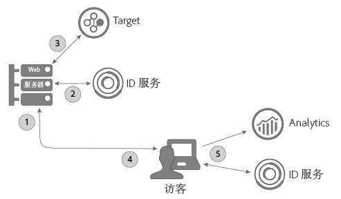
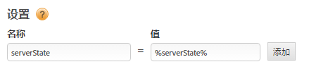

# 在 Target 的 A4T 和服务器端实施中使用 ID 服务 {#using-the-id-service-with-a-t-and-a-server-side-implementation-of-target}

这些说明适用于采用 Target、Analytics 和 ID 服务的混合服务器和客户端实施的 A4T 客户。需要在 NodeJS 或 Rhino 环境中运行 ID 服务的客户也应该查看此信息。此 ID 服务实例使用缩减版 VisitorAPI.js 代码库，您可以从 Node Package Manager (NPM) 下载和安装该代码库。请查看此部分，了解安装说明和其他配置要求。

## 简介 {#section-ab0521ff5bbd44c592c3eaab31c1de8b}

A4T（和其他客户）可以在以下情况下使用此版本的 ID 服务：

* 在其服务器上呈现网页内容，并将其传递给浏览器以供最终显示。
* 进行服务器端 [!DNL Target] 调用。
* 对 [!DNL Analytics] 进行客户端（浏览器内）调用。
* 同步单独的 [!DNL Target] 和 [!DNL Analytics] ID，以确定某个解决方案看到的访客是否就是其他解决方案看到的同一个人。

## 代码下载和提供的界面 {#section-32d75561438b4c3dba8861be6557be8a}

请参阅 [ID 服务 NPM 存储库](https://www.npmjs.com/package/@adobe-mcid/visitor-js-server)以下载服务器端代码包并查看当前内部版本中包含的界面。

## 工作流 {#section-56b01017922046ed96536404239a272b}

以下图表和部分介绍了在服务器端实施流程的每个步骤中所发生的情况，以及您需要配置的具体内容。



## 步骤 1：请求页面 {#section-c12e82633bc94e8b8a65747115d0dda8}

当访客发出加载网页的 HTTP 请求时，服务器端活动即会开始。在此步骤中，您的服务器会接收此请求并检查 [AMCV Cookie](../introduction/cookies.md)。AMCV Cookie 包含访客的 [!DNL Experience Cloud] ID (MID)。

## 步骤 2：生成 ID 服务负载 {#section-c86531863db24bd9a5b761c1a2e0d964}

接下来，您需要向 ID 服务发起服务器端 *`payload request`*。载荷请求会：

* 将 AMCV Cookie 传递到 ID 服务。
* 在如下所述的后续步骤中请求 Target 和 Analytics 所需的数据。

>[!NOTE]
>
>此方法会从 [!DNL Target] 中请求一个 mbox。如果您需要在一次调用中请求多个 mbox，请参阅 [generateBatchPayload](https://www.npmjs.com/package/@adobe-mcid/visitor-js-server#generatebatchpayload)。

您的负载请求应当类似于以下代码示例。在此代码示例中，`visitor.setCustomerIDs` 函数是可选的。请参阅[客户 ID 和身份验证状态](../reference/authenticated-state.md)以了解更多信息。

```js
//Import the ID service server package 
var Visitor = require("@adobe-mcid/visitor-js-server"); 
 
//Pass in your Organization ID to instantiate Visitor 
var visitor = new Visitor("Insert Experience Cloud ID here"); 
 
// 
<i>(Optional)</i> Set a custom customer ID 
visitor.setCustomerIDs({ 
     userid:{ 
          id:"1234", 
          authState: Visitor.AuthState.UNKNOWN //AuthState is a static property of the Visitor class 
     } 
}); 
 
//Parse the visitor's HTTP request for the AMCV cookie 
var cookies = cookie.parse(req.headers.cookie || ""); 
var cookieName = visitor.getCookieName(); // Visitor API that returns the cookie name. 
var amcvCookie = cookies[cookieName]; 
 
//Generate the payload request pass your mbox name and the AMCV cookie if present 
var visitorPayload = visitor.generatePayload({ 
     mboxName: "bottom-banner-mbox", 
     amcvCookie: amcvCookie 
});
```

ID 服务在 JSON 对象中返回负载，它类似于如下示例。[!DNL Target] 需要使用该负载数据。

```js
{ 
    "marketingCloudVisitorId": "02111696918527575543455026275721941645", 
    "mboxParameters": { 
        "mboxAAMB": "abcd1234", 
        "mboxMCGLH": "9", 
        "mboxMCSDID": "56BE026543F7E211-1CC51BCAAE88F0D2", 
        "vst.userid.id": "1234567890", 
        "vst.userid.authState": 0 
    } 
}
```

如果您的访客没有 AMCV Cookie，则负载会忽略以下键值对：

* `marketingCloudvisitorId`
* `mboxAAMB`
* `mboxMCGLH`

## 步骤 3：将负载添加到 Target 调用 {#section-62451aa70d2f44ceb9fd0dc2d4f780f7}

在您的服务器收到来自 ID 服务的负载数据之后，您需要实例化其他代码，以将其与传递到 [!DNL Target] 中的数据合并。传递到 [!DNL Target] 的最终 JSON 对象应类似于以下形式：

```js
{ 
"mbox" : "target-global-mbox", 
"marketingCloudVisitorId":"02111696918527575543455026275721941645", 
"requestLocation" : { 
     "pageURL" : "http://www.domain.com/test/demo.html", 
     "host" : "localhost:3000" 
     }, 
"mboxParameters" : { 
     "mboxAAMB" : "abcd1234", 
     "mboxMCGLH" : "9", 
     "mboxMCSDID": "56BE026543F7E211-1CC51BCAAE88F0D2", 
     "vst.userid.id": "1234567890", 
     "vst.userid.authState": 0, 
     } 
} 
```

## 步骤 4：获取 ID 服务的服务器状态 {#section-8ebfd177d42941c1893bfdde6e514280}

服务器状态数据包含在服务器上完成的工作的相关信息。客户端 ID 服务代码需要此信息。对于已通过 [!DNL Dynamic Tag Manager] (DTM) 实施 ID 服务的客户，可以配置 DTM 以通过该工具传递服务器状态数据。如果您是通过非标准流程设置的 ID 服务，则将需要使用您自己的代码返回服务器状态。客户端 ID 服务和 [!DNL Analytics] 代码会在页面加载时将状态数据传递到 Adobe。

**通过 DTM 获取服务器状态**

如果您是通过 DTM 实施的 ID 服务，则需要将代码添加到您的页面，并在 DTM 设置中指定一个名称-值对。

**页面代码**

将此代码添加到 HTML 页面的 `<head>` 标记中：

```js
//Get server state 
var serverState = visitor.getState(); 
 
Response.send(" 
... 
<head> 
     <script> 
          //Add 'serverState' as a stringified JSON global variable. 
          "var serverState = "+ JSON.stringify(serverState) +";  
     </script> 
     <script src = "DTM script (satellite JS)"> 
     </script> 
</head> 
...
```

**DTM 设置**

将它们作为名称-值对添加到 ID 服务实例的&#x200B;**[!UICONTROL 常规 > 设置]**&#x200B;部分中：

* **[!UICONTROL 名称：]** serverState
* **[!UICONTROL 值：]**%serverState%

   >[!IMPORTANT]
   >
   >值名称必须与在页面代码中为 `serverState` 设置的变量名称匹配。

您配置的设置应该如下所示：



**在没有使用 DTM 的情况下获取服务器状态**

如果您的 ID 服务是非标准实施，则必须将以下代码配置为在组织请求页面时在您的服务器上运行：

```js
//Get server state 
var serverState = visitor.getState(); 
 
Response.send(" 
... 
<head> 
     <script src="VisitorAPI.js"></script> 
     <script> 
          var visitor = Visitor.getInstance(orgID, { 
          serverState: serverState  
          ... 
     </script> 
</head> 
...
```

## 步骤 5：提供页面并返回 Experience Cloud 数据 {#section-4b5631a0d75a41febd6f43f8c214c263}

在这个时候，Web 服务器将页面内容发送到访客的浏览器。从此刻起，浏览器（不是服务器）发起所有剩余的 ID 服务和 [!DNL Analytics] 调用。例如，在浏览器中：

* ID 服务会从服务器接收状态数据并将 SDID 传递到 AppMeasurement。
* AppMeasurement 将页面点击的相关数据（包括 SDID）发送到 [!DNL Analytics]。
* [!DNL Analytics] 和 [!DNL Target] 会比较此访客的 SDID。如果 SDID 相同，则 [!DNL Target] 和 [!DNL Analytics] 将服务器端调用和客户端调用拼结在一起。此时，这两种解决方案会将此访客识别为同一个人。

>[!MORELIKETHIS]
>
>* [来自节点包管理器的服务器端 ID 服务包](https://www.npmjs.com/package/@adobe-mcid/visitor-js-server)

