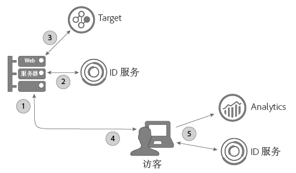

# 在Target的A4T和服务器端实施中使用访客ID服务 {#using-the-id-service-with-a-t-and-a-server-side-implementation-of-target}

这些说明适用于采用Target、Analytics和访客ID服务的混合服务器和客户端实施的A4T客户。 需要在NodeJS或Rhino环境中运行访客ID服务的客户也应该查看此信息。 此访客ID服务实例使用缩短版本的`VisitorAPI.js`代码库，您可以从Node Package Manager (NPM)下载并安装该代码库。 请查看此部分，了解安装说明和其他配置要求。

## 简介 {#section-ab0521ff5bbd44c592c3eaab31c1de8b}

A4T（和其他客户）可以在以下情况下使用此版本的访客ID服务：

* 在其服务器上呈现网页内容，并将其传递给浏览器以供最终显示。
* 进行服务器端Target调用。
* 对Analytics进行客户端（浏览器内）调用。
* 同步单独的Target ID和Analytics ID，以确定某个解决方案看到的访客是否就是另一个解决方案看到的同一个人。

## 代码下载和提供的界面 {#section-32d75561438b4c3dba8861be6557be8a}

查看[访客ID服务NPM存储库](https://www.npmjs.com/package/@adobe-mcid/visitor-js-server)以下载服务器端代码包并查看当前内部版本中包含的界面。

## 工作流 {#section-56b01017922046ed96536404239a272b}

以下图表和部分介绍了在服务器端实施流程的每个步骤中所发生的情况，以及您需要配置的具体内容。



## 步骤 1：请求页面 {#section-c12e82633bc94e8b8a65747115d0dda8}

当访客发出加载网页的 HTTP 请求时，服务器端活动即会开始。 在此步骤中，您的服务器会接收此请求并检查 [AMCV Cookie](../introduction/cookies.md)。 AMCV Cookie包含访客的ECID。

## 步骤2：生成访客ID服务负载 {#section-c86531863db24bd9a5b761c1a2e0d964}

接下来，您需要向访客ID服务发起服务器端&#x200B;*`payload request`*。 载荷请求会：

* 将AMCV Cookie传递到访客ID服务。
* 在如下所述的后续步骤中请求 Target 和 Analytics 所需的数据。

>[!NOTE]
>
>此方法会从Target请求单个mbox。 如果您需要在一次调用中请求多个 mbox，请参阅 [generateBatchPayload](https://www.npmjs.com/package/@adobe-mcid/visitor-js-server#generatebatchpayload)。

您的负载请求应当类似于以下代码示例。 在此代码示例中，`visitor.setCustomerIDs` 函数是可选的。 请参阅[客户 ID 和身份验证状态](../reference/authenticated-state.md)以了解更多信息。

```js
//Import the Visitor ID Service server package 
var Visitor = require("@adobe-mcid/visitor-js-server"); 
 
//Pass in your IMS org ID to instantiate Visitor 
var visitor = new Visitor("Insert ECID here"); 
 
// 
<i>(Optional)</i> Set a custom customer ID 
visitor.setCustomerIDs({ 
     userid:{ 
          id:"1234", 
          authState: Visitor.AuthState.UNKNOWN //AuthState is a static property of the Visitor class 
     } 
}); 
 
//Parse the visitor's HTTP request for the AMCV cookie 
var cookies = cookie.parse(req.headers.cookie || ""); 
var cookieName = visitor.getCookieName(); // Visitor API that returns the cookie name. 
var amcvCookie = cookies[cookieName]; 
 
//Generate the payload request pass your mbox name and the AMCV cookie if present 
var visitorPayload = visitor.generatePayload({ 
     mboxName: "bottom-banner-mbox", 
     amcvCookie: amcvCookie 
});
```

访客ID服务在JSON对象中返回负载，它类似于以下示例。 Target需要使用该负载数据。

```js
{ 
    "marketingCloudVisitorId": "02111696918527575543455026275721941645", 
    "mboxParameters": { 
        "mboxAAMB": "abcd1234", 
        "mboxMCGLH": "9", 
        "mboxMCSDID": "56BE026543F7E211-1CC51BCAAE88F0D2", 
        "vst.userid.id": "1234567890", 
        "vst.userid.authState": 0 
    } 
}
```

如果您的访客没有 AMCV Cookie，则负载会忽略以下键值对：

* `marketingCloudvisitorId`
* `mboxAAMB`
* `mboxMCGLH`

## 步骤 3：将负载添加到 Target 调用 {#section-62451aa70d2f44ceb9fd0dc2d4f780f7}

在您的服务器收到来自访客ID服务的负载数据之后，您需要实例化其他代码，以将其与传递到Target的数据合并。 传递到Target的最终JSON对象应类似于以下形式：

```js
{ 
"mbox" : "target-global-mbox", 
"marketingCloudVisitorId":"02111696918527575543455026275721941645", 
"requestLocation" : { 
     "pageURL" : "http://www.domain.com/test/demo.html", 
     "host" : "localhost:3000" 
     }, 
"mboxParameters" : { 
     "mboxAAMB" : "abcd1234", 
     "mboxMCGLH" : "9", 
     "mboxMCSDID": "56BE026543F7E211-1CC51BCAAE88F0D2", 
     "vst.userid.id": "1234567890", 
     "vst.userid.authState": 0, 
     } 
} 
```

## 步骤4：获取访客ID服务的服务器状态 {#section-8ebfd177d42941c1893bfdde6e514280}

服务器状态数据包含在服务器上完成的工作的相关信息。 客户端访客ID服务代码需要此信息。 如果您已通过非标准流程设置访客ID服务，则将需要使用您自己的代码返回服务器状态。 客户端访客ID服务和Analytics代码会在页面加载时将状态数据传递到Adobe。

如果您的访客ID服务是非标准实施，则必须将此代码配置为在组织所请求的页面时在您的服务器上运行：

```js
//Get server state 
var serverState = visitor.getState(); 
 
Response.send(" 
... 
<head> 
     <script src="VisitorAPI.js"></script> 
     <script> 
          var visitor = Visitor.getInstance(orgID, { 
          serverState: serverState  
          ... 
     </script> 
</head> 
...
```

## 步骤5：提供页面并返回CX Enterprise数据 {#section-4b5631a0d75a41febd6f43f8c214c263}

在这个时候，Web 服务器将页面内容发送到访客的浏览器。 从此刻起，浏览器（不是服务器）发起所有剩余的访客ID服务和Analytics调用。 例如，在浏览器中：

* 访客ID服务从服务器接收状态数据并将SDID传递到AppMeasurement。
* AppMeasurement将有关页面点击的数据（包括SDID）发送到Analytics。
* Analytics和Target会比较此访客的SDID。 如果SDID相同，则Target和Analytics会将服务器端调用和客户端调用拼合在一起。 此时，这两种解决方案会将此访客识别为同一个人。

>[!MORELIKETHIS]
>
>* 来自节点包管理器的[服务器端访客ID服务包](https://www.npmjs.com/package/@adobe-mcid/visitor-js-server)

