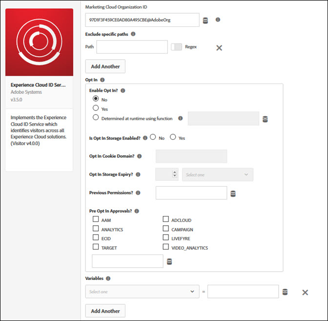

# 使用标记配置选择加入 {#configuring-opt-in-with-launch}

使用标记简化为选择加入启用CX Enterprise解决方案的过程。

## 使用标记配置选择加入方案 {#section-8aa1b58bf8374c938aa8cfdeddbad6ff}

通过Adobe Experience Platform数据收集中的[标记](https://experienceleague.adobe.com/docs/experience-platform/tags/home.html?lang=zh-Hans)，可以轻松配置和设置涉及Adobe解决方案的选择加入方案。 您可以让Analytics、Target、Audience Manager以及其他或所有精选CX企业解决方案能够选择加入您的同意管理系统，从而简化CX企业解决方案收集访客是否同意选择加入的过程。

**配置[!UICONTROL Experience Cloud ID Service]标记扩展**

如果尚未安装[!UICONTROL Experience Cloud ID Service]标记扩展，请打开您的属性，然后单击“*扩展*”>“*目录*”，将鼠标悬停在[!UICONTROL Experience Cloud ID Service]标记扩展上，然后单击“*安装*”。

要配置该扩展，请打开&#x200B;*扩展*&#x200B;选项卡，将鼠标悬停在该扩展上， 然后单击&#x200B;*配置*。

有关其他参考信息，请阅读[!UICONTROL Experience Cloud ID Service]标记扩展[概述](https://experienceleague.adobe.com/docs/experience-platform/tags/extensions/client/id-service/overview.html?lang=zh-Hans)（实现访客ID服务的扩展）。

