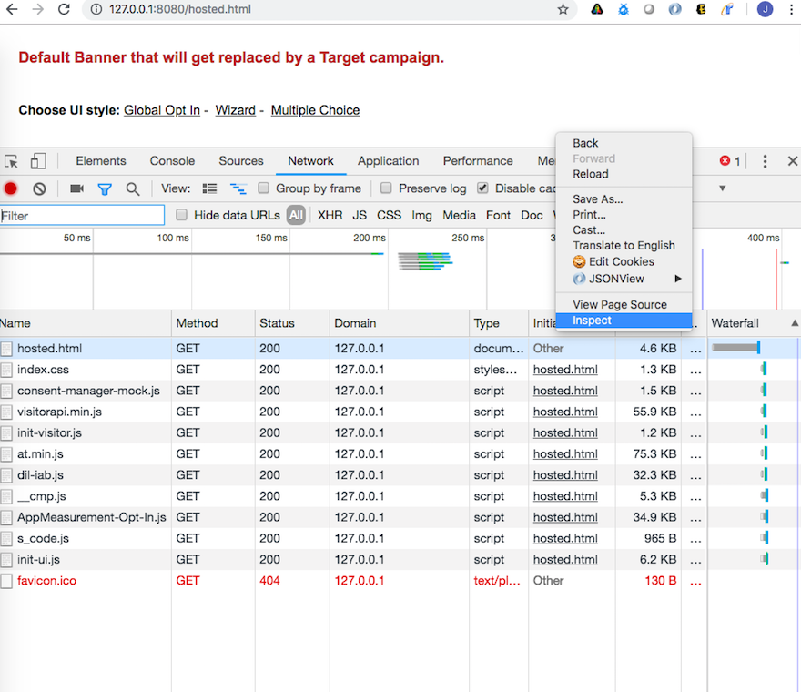

# 验证选择加入服务{#validating-opt-in-service}

在网站上启用了选择加入后，在浏览器中使用开发人员工具按照验证方法测试该服务是否正常工作。

## 用例1：启用选择加入 {#section-c8fe1ee3711b420c8186c7057abbecb3}

```
Visitor.getInstance({{YOUR_ORG_ID}}, { 
    doesOptInApply: true 
});
```



在加载该页面之前，清除您的缓存和 Cookie。

在 Chrome 中，右键单击相应网页并选择“检查”。如上面的屏幕快照所示，选择&#x200B;*网络*&#x200B;标签页以查看从浏览器发起的请求。

在上面的示例中，我们在该页面上安装了以下 Adobe JS 代码：ECID、AAM、Analytics 和 Target。

**如何证明选择加入正常工作：**

您应该不会看到向 Adobe 服务器发出的任何请求：

* demdex.net/id
* demdex.net/event
* omtrdc.net/b/ss
* omtrdc.net/m2
* everesttech.net

>[!NOTE]
>
>您可能会看到对 `http://dpm.demdex.net/optOutStatus` 的调用，这是一个“只读”端点，用于检索访客的选择退出状态。此端点不会导致创建任何第三方 Cookie，且不会从页面中收集任何信息。

您应该不会看到Adobe标记创建的任何Cookie： (`AMCV_{{YOUR_ORG_ID}}`、`mbox`、`demdex`、`s_cc`、`s_sq`、`everest_g_v2`、`everest_session_v2`)

在 Chrome 中，转到&#x200B;*应用程序*&#x200B;标签页，展开在&#x200B;*存储*&#x200B;下的 *Cookie*&#x200B;部分，然后选择您网站的域名：


## 用例2：启用选择加入和存储 {#section-bd28326f52474fa09a2addca23ccdc0f}

```
Visitor.getInstance({{YOUR_ORG_ID}}, { 
    doesOptInApply: true, 
    isOptInStorageEnabled: true 
});
```

用例 2 的唯一区别在于，您将看到&#x200B;*一个新 Cookie*（其中包含您的访客提供的选择加入权限）：**adobeujs-optin**

## 用例3：启用选择加入和预批准Adobe Analytics {#section-257fe582b425496cbf986d0ec12d3692}

```
var preApproveAnalytics = {}; 
preApproveAnalytics[adobe.OptInCategories.ANALYTICS] = true;

Visitor.getInstance({{YOUR_ORG_ID}}, { 
    doesOptInApply: true, 
    preOptInApprovals: preApproveAnalytics 
});
```

由于 Adobe Analytics 预先获得选择加入批准，因此您将在“网络”标签页中看到向您的跟踪服务器发出的请求：


而且，您将在“应用程序”标签页中看到 Analytics Cookie：


## 用例4：启用选择加入和IAB {#section-64331998954d4892960dcecd744a6d88}

```
Visitor.getInstance({{YOUR_ORG_ID}}, { 
    doesOptInApply: true, 
    isIabContext: true 
});
```

**如何在页面上查看您当前的 IAB 同意：**

打开开发者工具并选择 *Console* 标签页。粘贴以下代码段并按 Enter：

```
<codeblock>
  __cmp("getVendorConsents", null, function (vendorConsents) { 
     console.log("Vendor Consent:", vendorConsents); }) 
</codeblock>  
  
```

这是一个示例输出，其中用途 1、2 和 5 获得批准，并且 Audience Manager 供应商 ID 也获得批准：

* demdex.net/id：此调用的存在证实 ECID 已向 demdex.net 请求了 ID
* demdex.net/event：此调用的存在证实 DIL 数据收集调用按预期运行。
* demdex.net/dest5.html：此调用的存在证实正在触发 ID 同步。


如果不符合以下某种情况，您将不会看到向 Adobe 服务器发出任何请求，也不会看到任何 Adobe Cookie：

* 用途 1、2 或 5 未获得批准。
* Audience Manager 供应商 ID 未获得批准。
