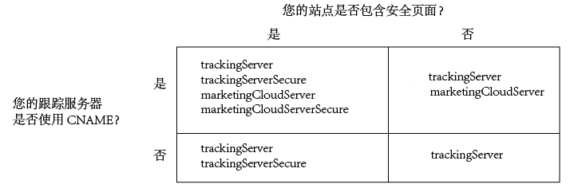

# 为Analytics、Audience Manager和Target实施Experience Platform Identity Service {#implement-the-experience-cloud-id-service-for-analytics-audience-manager-and-target}

这些说明适用于需要使用Experience Platform Identity Service且不使用Dynamic Tag Management(DTM)的Analytics、Audience Manager和Target客户。但是，我们强烈建议您使用 DTM 来实施此 ID 服务。DTM 可简化实施工作流程，并自动确保代码放置和排序的正确性。

>[!IMPORTANT]
>
>在开始之前请阅读ID服务 [要求](../reference/requirements.md) ，并请注意特定于此实施的以下要求：&gt;
>* 使用 s_code 的客户无法完成此过程。升级到 mbox 代码 v61 以完成此流程。
>* 请在生产环境中实施此代码*之前*，首先在开发环境中对它进行配置和测试。
>


## 步骤1：服务器端转发计划 {#section-880797cc992d4755b29cada7b831f1fc}

除了这里介绍的步骤以外，使用 [!DNL Analytics] 和 [!DNL Audience Manager] 的客户还应迁移到服务器端转发。服务器端转发允许您删除 DIL（Audience Manager 的数据收集代码），并将其替换为[受众管理模块](https://marketing.adobe.com/resources/help/en_US/aam/c_profiles_audiences.html)。请参阅[服务器端转发文档](https://marketing.adobe.com/resources/help/en_US/reference/ssf.html)，以了解更多信息。

迁移到服务器端转发需要规划和协作。此过程包含对网站代码的外部更改，以及 Adobe 必须执行来配置帐户的内部步骤。事实上，其中的许多迁移过程需要并行完成并一起发布。您的实施路径应当遵循以下事件顺序：

1. 与您的 [!DNL Analytics] 和 [!DNL Audience Manager] 联系人一起计划您的 ID 服务和服务器端转发迁移。将选择跟踪服务器作为此计划的重要环节。

1. [!DNL Profiles & Audiences]为您提供。完成[迁移和配置网站](https://adobe.allegiancetech.com/cgi-bin/qwebcorporate.dll?idx=X8SVES)上的表单，以开始使用。

1. 同时实施ID [!DNL Audience Management Module] 服务。要正常工作，必须为同一组页面同时发布 [!DNL Audience Management Module] (服务器端转发)和ID服务。

## 步骤2：下载ID服务代码 {#section-0780126cf43e4ad9b6fc5fe17bb3ef86}

ID 服务 要求具备 `VisitorAPI.js` 代码库。要下载此代码库，请执行以下操作：

1. 转至 **[!UICONTROL 管理员&gt;代码管理器]**。
1. 在代码管理器中，单击 **[!UICONTROL JavaScript(New)]** 或 **[!UICONTROL JavaScript(传统)]**。此下载文件对代码库进行了压缩。

1. 解压缩代码文件，并打开 `VisitorAPI.js` 文件。

## 步骤3：将Detailtor. getInstance函数添加到ID服务代码 {#section-9e30838b4d0741658a7a492153c49f27}

>[!IMPORTANT]
>
>* ID 服务 API 的早期版本将此函数放置在其他位置，并且需要使用不同的语法。如果您要从[版本 1.4](../release-notes/notes-2015.md#section-f5c596f355b14da28f45c798df513572) 之前的版本迁移，请注意此处记录的新放置位置和语法。
>* 全部大写的代码是一个对应实际值的占位符。将此文本替换为您的组织 ID、跟踪服务器 URL 或其他指定值。
>


**第 1 部分：复制下面的 Visitor.getInstance 函数**

```js
var visitor = Visitor.getInstance("INSERT-MARKETING-CLOUD-ORGANIZATION ID-HERE", { 
     trackingServer: "INSERT-TRACKING-SERVER-HERE", // same as s.trackingServer 
     trackingServerSecure: "INSERT-SECURE-TRACKING-SERVER-HERE", // same as s.trackingServerSecure 
 
     // To enable CNAME support, add the following configuration variables 
     // If you are not using CNAME, DO NOT include these variables 
     marketingCloudServer: "INSERT-TRACKING-SERVER-HERE", 
     marketingCloudServerSecure: "INSERT-SECURE-TRACKING-SERVER-HERE" // same as s.trackingServerSecure 
}); 
```

**第 2 部分：将函数代码添加到 VisitorAPI.js 文件**

将 `Visitor.getInstance` 函数放置在位于文件末尾的代码块后面。您编辑的文件应该类似于下面的样子：

```js
/* 
========== DO NOT ALTER ANYTHING BELOW THIS LINE ========== 
Version and copyright section 
*/ 
 
// Visitor API code library section 
 
// Put Visitor.getInstance at the end of the file, after the code library 
 
var visitor = Visitor.getInstance("INSERT-MARKETING-CLOUD-ORGANIZATION ID-HERE", { 
     trackingServer: "INSERT-TRACKING-SERVER-HERE", // same as s.trackingServer 
     trackingServerSecure: "INSERT-SECURE-TRACKING-SERVER-HERE", // same as s.trackingServerSecure 
 
     // To enable CNAME support, add the following configuration variables 
     // If you are not using CNAME, DO NOT include these variables 
     marketingCloudServer: "INSERT-TRACKING-SERVER-HERE", 
     marketingCloudServerSecure: "INSERT-SECURE-TRACKING-SERVER-HERE" // same as s.trackingServerSecure 
}); 
```

## 第步：将Experience Cloud组织ID添加到Compositor. getInstance {#section-e2947313492546789b0c3b2fc3e897d8}

在 `Visitor.getInstance` 函数中，替换 `INSERT-MARKETING-CLOUD-ORGANIZATION ID-HERE` 为Experience Cloud组织ID。如果您不知道自己的组织 ID，可以在 Experience Cloud 管理页面上查找。您编辑的函数看起来类似于下面的示例。

`var visitor = Visitor.getInstance("1234567ABC@AdobeOrg", { ...`

>[!IMPORTANT]
>
>*请勿* 更改单位ID中字符的大小写。这个 ID 是区分大小写的，因此必须严格按照所提供的形式使用。

## 第步：将跟踪服务器添加到Compositor. getInstance {#section-0dfc52096ac2427f86045aab9a0e0dfc}

Analytics 使用跟踪服务器进行数据收集。

**第 1 部分：查找您的跟踪服务器 URL**

检查您 `s_code.js` 或 `AppMeasurement.js` 文件以查找跟踪服务器URL。您将需要由以下变量指定的 URL：

* `s.trackingServer`
* `s.trackingServerSecure`

**第 2 部分：设置跟踪服务器变量**

要确定需要使用哪些跟踪服务器变量，请执行以下操作：

1. 回答以下决策矩阵中的问题。使用与您的回答相对应的变量。
1. 将跟踪服务器占位符替换为您的跟踪服务器 URL。
1. 从代码中删除未使用的跟踪服务器和 Experience Cloud 服务器变量。



>[!NOTE]
>
>使用后，将Experience Cloud服务器URL与其相应跟踪服务器URL匹配，如下所示：

* Experience Cloud 服务器 URL = 跟踪服务器 URL
* Experience Cloud 服务器安全 URL = 跟踪服务器安全 URL

如果您不确定如何查找跟踪服务器，请参阅[常见问题解答](../faq-intro/faq.md)以及[正确填充 trackingServer 和 trackingServerSecure 变量](https://helpx.adobe.com/analytics/kb/determining-data-center.html#)。

## 步骤6：更新AppMeasurement. js文件 {#section-5517e94a09bc44dfb492ebca14b43048}

此步骤 [!DNL AppMeasurement]需要执行。如果您仍使用 s_code，则无法继续。

将下面显示的 `Visitor.getInstance` 函数添加到 `AppMeasurement.js` 文件中。将其放入包含诸如 `linkInternalFilters`以下 `charSet`配置的配置 `trackDownloads`中：

`s.visitor = Visitor.getInstance("INSERT-MARKETING-CLOUD-ORGANIZATION ID-HERE");`

>[!IMPORTANT]
>
>此时，您应删除 [!DNL Audience Manager] DIL代码并将其替换为受众管理模块。请参阅[实施服务器端转发](https://marketing.adobe.com/resources/help/en_US/reference/ssf.html)，以获取相关说明。

***（可选，但是推荐）*创建自定义 prop**

在 `AppMeasurement.js` 中设置自定义 prop 来测量范围. 将此自定义 prop 添加到 `doPlugins` 文件的 `AppMeasurement.js` 函数中：

```js
// prop1 is used as an example only. Choose any available prop. 
s.prop1 = (typeof(Visitor) != "undefined" ? "VisitorAPI Present" : "VisitorAPI Missing");
```

## 第步：将访问者API代码添加到页面 {#section-c2bd096a3e484872a72967b6468d3673}

将文件 ` [!DNL VisitorAPI.js]` 放在每个页面 `<head>` 上的标记内。在将 `VisitorAPI.js` 文件放入页面之后，您可以：

* 将它放在 `<head>` 部分的开头，在其他解决方案标签之前显示。
* 它必须在 AppMeasurement 以及其他 [!DNL Experience Cloud] 解决方案的代码之前执行。

## 步骤8：(可选)配置宽限期 {#section-aceacdb7d5794f25ac6ff46f82e148e1}

如果这些使用案例适用于您的情况，请要求 [客户服务部门](https://helpx.adobe.com/marketing-cloud/contact-support.html) 设置临时 [宽限期](../reference/analytics-reference/grace-period.md)。宽限期可长达 180 天。您可以在必要时延长宽限期。

**部分实施**

如果您的某些页面使用 ID 服务而某些页面没有使用，并且它们全部报告到同一个 Analytics 报表包中，那么就需要设置宽限期。这对于一个跨域报告的全局报表包来说，设置宽限期是很常见的。

当报告到同一报表包中的所有网页都部署了 ID 服务后，就可以中止宽限期。

**s_vi Cookie 要求**

如果在迁移到 ID 服务后，您要求新访客具有 s_vi Cookie，则需要设置宽限期。当您的实施需要读取 s_vi Cookie 并将其存储在变量中时，设置宽限期是很常见的。

在您的实施可以捕获 MID 而不是读取 s_vi Cookie 时，就可以中止宽限期。

另请参阅 [Cookie和Experience Platform Identity Service](../introduction/cookies.md)。

**点击流数据集成**

如果您将来自点击流数据馈送和使用 `visid_high` 及 `visid_low` 列的流程中的数据发送至内部系统，则需要设置宽限期。

数据摄取流程可使用和 `post_visid_high``post_visid_low` 列后停止宽限期。

另请参阅[点击流数据列引用](https://marketing.adobe.com/resources/help/en_US/sc/clickstream/datafeeds_reference.html)。

## 第步：测试和验证 {#section-f857542bfc70496dbb9f318d6b3ae110}

此实施中的 [!DNL Experience Cloud] 解决方案会以键值对的形式返回 ID。每个解决方案分别使用不同的键（例如 [!DNL Analytics] SDID 和 [!DNL Target] mboxMCSDID）来保存同一 ID。要测试您的实施，请在开发环境中加载您的页面。使用您的浏览器控制台或软件监视HTTP请求和响应，以检查下面列出的ID。如果下面列出的键值对返回相同的 ID 值，则表明 ID 服务已得到正确实施。

>[!TIP]
>
>您可以使用 [Adobe调试器](https://marketing.adobe.com/resources/help/en_US/sc/implement/?f=debugger.html) 或 [Charles HTTP代理](https://www.charlesproxy.com/) 来检查这些特定于解决方案的ID。当然，您也可以随意使用最适合您的任何工具或调试器。

**所有解决方案**

检查以下内容：

* [托管页面的域中的 AMCV Cookie](../introduction/cookies.md)。
* [!DNL Experience Cloud] ID(MID)与 [!DNL Adobe] 调试器或首选调试工具。

有关帮助您确定ID服务是否正常运行的其他检查，请参阅 [测试和验证体验平台标识服务](../implementation-guides/test-verify.md)。

**Analytics**

在 JavaScript 请求中查找 SDID 标识符。Analytics SDID 应当与 Target mboxMCSDID 匹配。

如果您的测试返回 AID，则表示存在以下任一情况：

* 您是正在迁移旧版 [!DNL Analytics] ID 的回访访客。
* 您启用 [了宽限期](../reference/analytics-reference/grace-period.md) 。

如果您看到 AID，请检查它的值是否与 [!DNL Target] mboxMCAVID 一致。如果 ID 服务实施正确，则这些值是相同的。

**Audience Manager**

要测试服务器端转发，请参阅：

* [如何确定您的帐户是否已准备好接收转发的数据](https://marketing.adobe.com/resources/help/en_US/aam/ssf-success.html)
* [如何确定您的帐户是否还未准备好接收转发的数据](https://marketing.adobe.com/resources/help/en_US/aam/ssf-fail.html)

**Target**

检查以下内容：

* mboxMCGVID
* mboxMCSDID（mboxMCSDID 应与 Analytics SDID 匹配。）

如果您的测试返回 mboxMCAVID，则表示存在以下任一情况：

* 您是正在迁移旧版 [!DNL Analytics] ID 的回访访客。
* 您已启用了宽限期。

如果您看到 mboxMCAVID，请检查它的值是否与 [!DNL Analytics] AID 一致。如果 ID 服务实施正确，则这些值是相同的。

**部署**

## 第10步：部署 {#section-4188fa95e7dc455a986b48a6c517c1c9}

部署通过了测试的代码。

如果您启用了宽限期：

* 请确保 Analytics ID (AID) 和 MID 都在图像请求中。
* 当您符合[中止宽限期的条件](../implementation-guides/setup-aam-analytics-target.md#section-aceacdb7d5794f25ac6ff46f82e148e1)时，请记得禁用宽限期。

