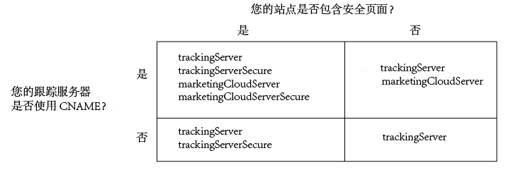

# 实施适用于 Analytics 的 Experience Cloud Identity 服务{#implement-the-experience-cloud-id-service-for-analytics}

这些说明适用于那些想要使用 Experience Cloud Identity 服务而不使用 Dynamic Tag Management (DTM) 的 Analytics 客户。但是，我们强烈建议您使用DTM来实施ID服务。 DTM简化了实施工作流程，并自动确保正确的代码放置和排序。

>[!IMPORTANT]
>
>* [请在开始之前阅读相关要求。](../reference/requirements.md)
>* 请在生产环境中实施此代码之前，首先在开发环境中对它进行配置和测试。
>


请按照以下步骤为 Adobe Analytics 实施 ID 服务：

1. [下载 ID 服务代码](../implementation-guides/setup-analytics.md#section-ead9403a6b7e45b887f9ac959ef89f7f)
1. [将 Visitor.getInstance 函数添加到 ID 服务代码中](../implementation-guides/setup-analytics.md#section-6053a6b7c16c466a9f9fdbf9cb9db3df)
1. [将您的 Experience Cloud 组织 ID 添加到 Visitor.getInstance](../implementation-guides/setup-analytics.md#section-7b8a6e76dc124d0e9ab1ce96ab2ffb0e)
1. [将您的跟踪服务器添加到 Visitor.getInstance](../implementation-guides/setup-analytics.md#section-70ec9ebff47940d8ab520be5ec4728c5)
1. [更新您的 AppMeasurement.js 或 s_code.js 文件](../implementation-guides/setup-analytics.md#section-b53113aea1bd4de896e0e4e9a7edee19)
1. [将访客 API 代码添加到页面中](../implementation-guides/setup-analytics.md#section-d46d6aa324c842f2931d901e38d6db1d)
1. [（可选）配置宽限期](../implementation-guides/setup-analytics.md#section-7bbb2f72c26e4abeb8881e18366797a3)
1. [测试和部署 ID 服务代码](../implementation-guides/setup-analytics.md#section-e9c1764ac21a4ec5be1ff338c0e2e01b)

## 步骤 1：下载 ID 服务代码 {#section-ead9403a6b7e45b887f9ac959ef89f7f}

[!UICONTROL ID 服务] 要求具备 `VisitorAPI.js` 代码库。要下载此代码库，请执行以下操作：

1. Go to **[!UICONTROL Admin]** > **[!UICONTROL Code Manager]**.
1. 在[!UICONTROL 代码管理器]中，单击 **[!UICONTROL JavaScript（新版）]**&#x200B;或 **[!UICONTROL JavaScript（旧版）]**。

   此下载文件对代码库进行了压缩。

1. 解压缩代码文件，并打开 `VisitorAPI.js` 文件。

## 步骤 2. 将 Visitor.getInstance 函数添加到 ID 服务代码中 {#section-6053a6b7c16c466a9f9fdbf9cb9db3df}

>[!IMPORTANT]
>
>* 先前版本的ID服务API将此函数放置在不同的位置，并需要不同的语法。 如果您是从版本1.4之前的 [版本迁移](../release-notes/notes-2015.md#section-f5c596f355b14da28f45c798df513572)，请注意此处介绍的新位置和语法。
>* ALL CAPS中的代码是实际值的占位符。 将此文本替换为您的组织ID、跟踪服务器URL或其他命名值。
>


**第1部分： 复制下面的访客.getInstance函数**

```js
var visitor = Visitor.getInstance("INSERT-MARKETING-CLOUD-ORGANIZATION-ID-HERE", { 
     trackingServer: "INSERT-TRACKING-SERVER-HERE", // same as s.trackingServer 
     trackingServerSecure: "INSERT-SECURE-TRACKING-SERVER-HERE", // same as s.trackingServerSecure 
 
     // To enable CNAME support, add the following configuration variables 
     // If you are not using CNAME, DO NOT include these variables 
     marketingCloudServer: "INSERT-TRACKING-SERVER-HERE", 
     marketingCloudServerSecure: "INSERT-SECURE-TRACKING-SERVER-HERE" // same as s.trackingServerSecure 
}); 
```

**第2部分： 将函数代码添加到VisitorAPI.js文件**

将 `Visitor.getInstance` 函数放置在位于文件末尾的代码块后面。您编辑的文件应该类似于下面的样子：

```js
/* 
========== DO NOT ALTER ANYTHING BELOW THIS LINE ========== 
Version and copyright section 
*/ 
 
// Visitor API code library section 
 
// Put Visitor.getInstance at the end of the file, after the code library

var visitor = Visitor.getInstance("INSERT-MARKETING-CLOUD-ORGANIZATION-ID-HERE", { 
     trackingServer: "INSERT-TRACKING-SERVER-HERE", // same as s.trackingServer 
     trackingServerSecure: "INSERT-SECURE-TRACKING-SERVER-HERE", // same as s.trackingServerSecure 
 
     // To enable CNAME support, add the following configuration variables 
     // If you are not using CNAME, DO NOT include these variables 
     marketingCloudServer: "INSERT-TRACKING-SERVER-HERE", 
     marketingCloudServerSecure: "INSERT-SECURE-TRACKING-SERVER-HERE" // same as s.trackingServerSecure 
}); 
```

## 步骤 3：将您的 Experience Cloud 组织 ID 添加到 Visitor.getInstance {#section-7b8a6e76dc124d0e9ab1ce96ab2ffb0e}

在 `Visitor.getInstance` 函数中，将 `INSERT-MARKETING-CLOUD-ORGANIZATION ID-HERE` 替换为您的 [!DNL Experience Cloud] 组织 ID。如果您不知道自己的组织 ID，可以在 [!DNL Experience Cloud] 管理页面上查找。另请参阅 [管理——核心服务](https://docs.adobe.com/content/help/zh-Hans/core-services/interface/manage-users-and-products/admin-getting-started.html)。 您编辑的函数看起来类似于下面的示例。

`var visitor = Visitor.getInstance("1234567ABC@AdobeOrg", { ...`

>[!IMPORTANT]
>
>*请不要*&#x200B;更改组织 ID 中字符的大小写。这个 ID 是区分大小写的，因此必须严格按照所提供的形式使用。

## 步骤 4：将您的跟踪服务器添加到 Visitor.getInstance {#section-70ec9ebff47940d8ab520be5ec4728c5}

跟踪服务器可用于 [!DNL Analytics] 数据收集。

**第 1 部分：查找您的跟踪服务器 URL**

检查您的 `s_code.js` 或 `AppMeasurement.js` 文件，以查找跟踪服务器 URL。您将需要由以下变量指定的 URL：

* `s.trackingServer`
* `s.trackingServerSecure`

**第2部分： 设置跟踪服务器变量**

要确定要使用的跟踪服务器变量，请执行以下操作：

1. 在下面的决策矩阵中回答问题。 使用与答案对应的变量。
1. 将跟踪服务器占位符替换为跟踪服务器URL。
1. 从代码中删除未使用的跟踪服务器和 [!DNL Experience Cloud] 服务器变量。



>[!NOTE]
>
>在使用时，请将 [!DNL Experience Cloud] 服务器 URL 与它们相对应的跟踪服务器 URL 相匹配，如下所示：>
>* [!DNL Experience Cloud] 服务器 URL = 跟踪服务器 URL
>* [!DNL Experience Cloud] 服务器安全 URL = 跟踪服务器安全 URL
>


如果您不确定如何找到跟踪服务器，请参阅[常见问题解答](../faq-intro/faq.md)和[正确填充 trackingServer 和 trackingServerSecure 变量](https://helpx.adobe.com/cn/analytics/kb/determining-data-center.html#)。

## 步骤 5：更新您的 AppMeasurement.js 或 s_code.js 文件 {#section-b53113aea1bd4de896e0e4e9a7edee19}

将这个函数添加到您的 `AppMeasurement.js` 或 `s_code.js` 文件：

`s.visitor = Visitor.getInstance("INSERT-MARKETING-CLOUD-ORGANIZATION ID-HERE");`

将这个代码放置在包含 `linkInternalFilters`、`charSet`、`trackDownloads` 等配置的相同部分中。

***（可选，但是推荐）*创建自定义 prop **

在 `AppMeasurement.js` 或 `s_code.js` 中设置自定义 prop 以测量覆盖范围。将此自定义 prop 添加到 `AppMeasurement.js` 或 `s_code.js` 文件的 `doPlugins` 函数中：

```js
// prop1 is used as an example only. Choose any available prop. 
s.prop1 = (typeof(Visitor) != "undefined" ? "VisitorAPI Present" : "VisitorAPI Missing");
```

## 步骤 6：将访客 API 代码添加到页面中 {#section-d46d6aa324c842f2931d901e38d6db1d}

将 `VisitorAPI.js` 文件放置在每个页面的 `<head>` 标记之内。在将 `VisitorAPI.js` 文件放入页面之后，您可以：

* 将它放在 `<head>` 部分的开头处，使其显示在其他解决方案标记之前。
* 它必须在 AppMeasurement 以及其他 [!DNL Experience Cloud] 解决方案的代码之前执行。

在测试和验证后将此代码移入生产环境中。

## 步骤 7：（可选）配置宽限期 {#section-7bbb2f72c26e4abeb8881e18366797a3}

If any of these use cases apply to your situation, ask [Customer Care](https://helpx.adobe.com/cn/marketing-cloud/contact-support.html) to set up a temporary [grace period](../reference/analytics-reference/grace-period.md). 宽限期最长可为180天。 您可以根据需要续订宽限期。

**部分实施**

如果您的某些页面使用 ID 服务而某些页面没有使用，并且它们全部报告到同一个 [!DNL Analytics] 报表包中，那么就需要设置宽限期。如果您有一个跨域报告的全局报告套件，则这种情况很常见。

在将ID服务部署到报告到同一报表包的所有网页后，停止宽限期。

**s_vi Cookie要求**

如果您需要新访客在迁移到ID服务后具有s_vi cookie，则需要宽限期。 如果您的实现读取s_vi cookie并将其存储在变量中，则这是常见的。

在实施可捕获MID而不是读取s_vi cookie后，停止宽限期。

See, [Cookies and the Experience Cloud Identity Service](../introduction/cookies.md).

如果您将来自点击流数据馈送和使用 `visid_high` 及 `visid_low` 列的流程中的数据发送至内部系统，则需要设置宽限期。

当您的数据获取流程可以使用 `post_visid_high` 和 `post_visid_low` 列之后，就可以中止宽限期。

请参 [阅Clickstream Data Column Reference](https://docs.adobe.com/content/help/zh-Hans/analytics/export/analytics-data-feed/data-feed-overview.html)。

**点击流数据获取**

## 步骤 8：测试和部署 ID 服务代码 {#section-e9c1764ac21a4ec5be1ff338c0e2e01b}

您可以按如下方式进行测试和部署。

**测试和验证**

要测试 ID 服务的实施状况，请检查以下环节：

* [托管页面](../introduction/cookies.md) 的域中的AMCV cookie。
* 使用Adobe调试器 [!DNL Analytics] 工具在图像请求 [中输入MID值](https://docs.adobe.com/content/help/en/analytics/implementation/validate/debugger.html)。

另请参阅[测试和验证 Experience Cloud Identity 服务](../implementation-guides/test-verify.md)。

**部署代码**

通过测试后部署代码。

如果您在步骤7中启用了 [宽限期](../implementation-guides/setup-analytics.md#section-7bbb2f72c26e4abeb8881e18366797a3):

* 请确保 [!DNL Analytics] ID (AID) 和 MID 都在图像请求中。
* 当您符合中止宽限期的条件时，请记住禁用宽限期。
