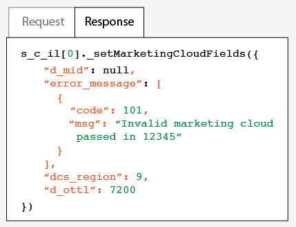

# 测试和验证Adobe访客ID服务{#test-and-verify-the-experience-cloud-id-service}

这些说明、工具和过程可帮助您确定访客ID服务是否正常运行。 这些测试通常适用于访客ID服务，也适用于不同的访客ID服务和CX Enterprise解决方案组合。

## 开始之前 {#section-b1e76ad552ed4eb793b6e521a55127d4}

在开始测试和验证访客ID服务之前需要了解的重要信息。

**浏览器环境**

在正常的浏览器会话中进行测试时，请在每次测试前清除浏览器缓存。

或者，您可以在匿名或无痕浏览器会话中测试访客ID服务。 在匿名会话中，您无需在每次测试前都清除浏览器 Cookie 或缓存。

**工具**

[Adobe调试器](https://experienceleague.adobe.com/docs/analytics/implementation/validate/debugger.html?lang=zh-Hans)和[Charles HTTP代理](https://www.charlesproxy.com/)可以帮助您确定访客ID服务是否已配置为与Analytics正常配合使用。 此部分中的信息基于 Adobe 调试器和 Charles 返回的结果。 当然，您也可以随意使用最适合您的任何工具或调试器。

## 使用 Adobe 调试器进行测试 {#section-861365abc24b498e925b3837ea81d469}

当您在Adobe Debugger响应中看到ECID时，即表明您的服务集成配置正确。 有关MID的详细信息，请参阅[Cookie和访客ID服务](../introduction/cookies.md)。

要使用Adobe [调试器](https://experienceleague.adobe.com/docs/analytics/implementation/validate/debugger.html?lang=zh-Hans)验证访客ID服务的状态，请执行以下操作：

1. 清除您的浏览器 Cookie 或打开匿名浏览会话。
1. 加载包含访客ID服务代码的测试页面。
1. 打开Adobe Debugger。
1. 在结果中检查 MID。

## 了解 Adobe 调试器结果 {#section-bd2caa6643d54d41a476d747b41e7e25}

MID存储在一个键值对中，它使用以下语法： `MID= *`ECID`*`。 调试器将显示此信息，如下所示。

**成功**

如果您看到类似于下面的响应，则表示访客ID服务已正确实施：

```
mid=20265673158980419722735089753036633573
```

如果您是Analytics客户，则除了MID，还可能看到Analytics ID (AID)。 这种情况发生于：

* 您的一些早期/长期网站访客。
* 您已启用宽限期时。

**失败**

如果调试器出现以下情况，请联系[客户关怀](https://helpx.adobe.com/cn/marketing-cloud/contact-support.html)：

* 不返回 MID。
* 返回一条错误消息，指示您的合作伙伴 ID 尚未配置。

## 通过 Charles HTTP 代理进行测试 {#section-d9e91f24984146b2b527fe059d7c9355}

要通过Charles验证访客ID服务的状态，请执行以下操作：

1. 清除您的浏览器 Cookie 或打开匿名浏览会话。
1. 启动 Charles。
1. 加载包含访客ID服务代码的测试页面。
1. 查看下述请求和响应调用以及数据。

## 了解 Charles 结果 {#section-c10c3dc0bb9945cbaffcf6fec7082fab}

有关查看位置、搜寻对象以及何时使用 Charles 监视 HTTP 调用的信息，请参阅此部分。

Charles中成功的&#x200B;**访客ID服务请求**

当`Visitor.getInstance`函数对`dpm.demdex.net`进行JavaScript调用时，您的访客ID服务代码工作正常。 成功的请求包含您的[IMS组织ID](../reference/requirements.md#section-a02f537129a64ffbb690d5738d360c26)。 IMS组织ID作为使用以下语法的键值对传递： `d_orgid= *`IMS组织ID`*`。 在 [!UICONTROL Structure] 选项卡下方查找 `dpm.demdex.net` 和 JavaScript 调用。 在[!UICONTROL Request]选项卡下方查找您的IMS组织ID。


Charles中成功的&#x200B;**访客ID服务响应**

当来自[数据收集服务器](https://experienceleague.adobe.com/docs/audience-manager/user-guide/reference/system-components/components-data-collection.html?lang=zh-Hans) (DCS)的响应返回MID时，您的帐户已正确配置为访客ID服务。 MID作为使用以下语法的键值对返回： `d_mid: *`访客ECID`*`。 在 [!UICONTROL Response] 选项卡中查找 MID，如下所示。


Charles中的&#x200B;**失败的访客ID服务响应**

如果 DCS 响应中缺失 MID，则表示您的帐户未正确配置。 失败的响应在 [!UICONTROL Response] 选项卡中返回一个错误代码和消息，如下所示。 如果您在 DCS 响应中看到此错误消息，请联系客户关怀。



有关错误代码的更多信息，请参阅 [DCS 错误代码、消息和示例](https://experienceleague.adobe.com/docs/audience-manager/user-guide/api-and-sdk-code/dcs/dcs-api-reference/dcs-error-codes.html?lang=zh-Hans)。

