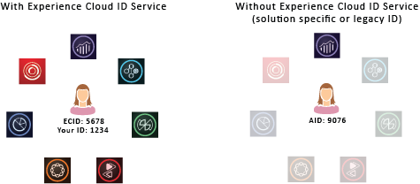

# 关于 ID 服务{#aboutidservice}

Experience Cloud Identity 服务在 Adobe Experience Cloud 中的角色。

<!--
mcvid-functionality.xml
-->

## Experience Cloud Identity 服务：核心服务的基本元素{#section-2de0eb1d65664e92a4d8bbb167b84bde}

Experience Cloud Identity 服务允许将通用识别框架用于 Experience Cloud 核心服务、解决方案、客户属性和受众。它通过向网站访客分配一个唯一的永久性 ID 来工作。在您的组织实施 ID 服务后，您可以通过此 ID 在不同的 Experience Cloud 解决方案中识别同一网站访客及其数据。

此外，ID 服务还可替代特定于不同解决方案的 ID（例如 Analytics AID）。并且，通过[客户 ID 和身份验证状态](../reference/authenticated-state.md)功能，ID 服务允许您将自己的客户 ID 传递到 [!DNL Experience Cloud]。但是请记住，ID 服务只能在您已经订阅的解决方案中使用。它不提供对其他未注册产品的访问权限。

今后，ID 服务将成为许多当前和将来推出的 [!DNL Experience Cloud] 功能、增强功能和服务中的必备组件。当前，ID 服务支持 [Analytics](http://www.adobe.com/cn/marketing-cloud/web-analytics.html)、[Audience Manager](http://www.adobe.com/cn/marketing-cloud/data-management-platform.html) 和 [Target](http://www.adobe.com/cn/marketing-cloud/testing-targeting.html)。另外，如果您要参与 [!DNL Adobe Experience Cloud] 设备协作，也需要使用该服务。如果您还没有实施 ID 服务，现在是时候开始考虑迁移策略了。有关 ID 服务的重要性和角色的更多信息，请参阅[为什么您应考虑使用 Experience Cloud Identity 服务](http://blogs.adobe.com/digitalmarketing/analytics/why-new-adobe-marketing-cloud-id-service-should-be-on-your-radar/)。

## 功能摘要 {#section-96555473455c4bf8924c2d56ff4f3255}

概括来说，ID 服务具备以下功能：

* 创建可用于关联配置文件和身份的通用密钥或 ID。
* 在多个解决方案中对设备进行唯一标识。
* 在客户的域中设置第一方 Cookie 以确保进行同域跟踪。请参阅 [Experience Cloud](../introduction/cookies.md)。
* 接收来自 [!DNL Experience Cloud] 客户和合作伙伴的别名和 ID 映射。
* 管理 [!DNL Experience Cloud] 内的 ID 同步。
* 支持与广告技术生态系统中的不同第三方进行 ID 同步。
