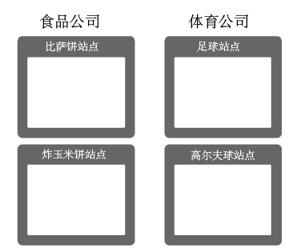
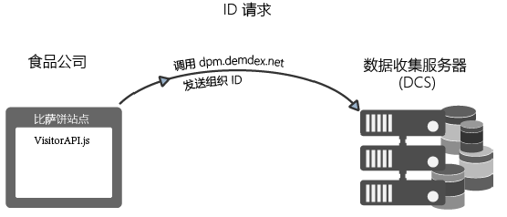
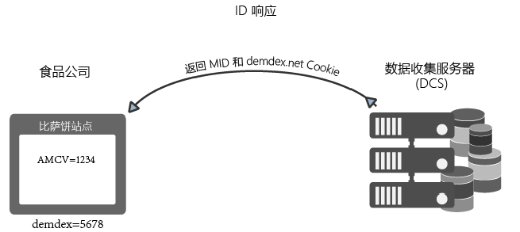
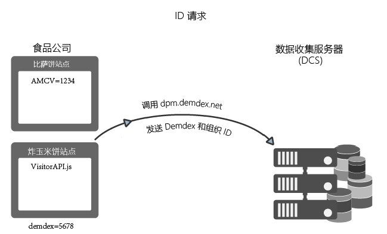
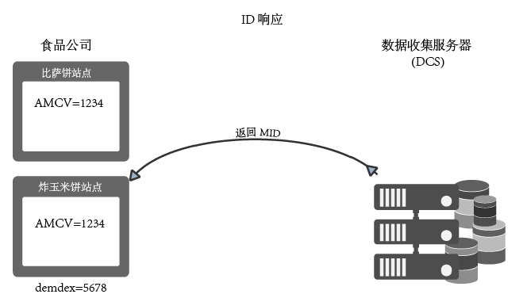
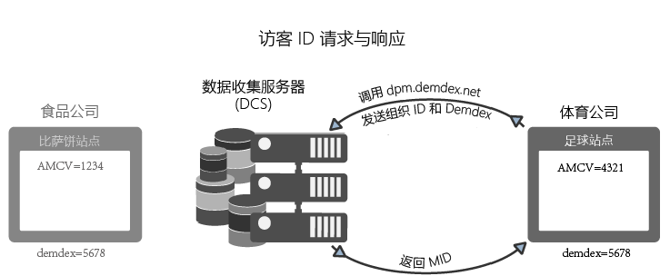

# Experience Cloud Identity 服务如何请求和设置 ID{#how-the-experience-cloud-id-service-requests-and-sets-ids}

ID 请求和响应过程概述。下面的示例涵盖了各种网站类型中的 ID 分配情况：单独的网站上、不同的网站之间，以及由 Experience Cloud 不同客户使用其各自组织 ID 管理的网站。

>[!NOTE]
>
>如果您不熟悉 Experience Cloud Identity 服务如何创建访客 ID，请花些时间查阅 [Experience Cloud](../introduction/cookies.md)。

**提示：**&#x200B;另请观看我们发布的 [ID 服务跨域跟踪视频](https://helpx.adobe.com/cn/marketing-cloud-core/kb/MCID/CrossDomain.html)。

## 请求 Experience Cloud ID {#section-0b5e261fbd0547d9b9a1680e5ce536cc}

下面的示例演示了 ID 服务如何请求和接收 Experience Cloud 访客 ID。这些示例使用了两个虚构的公司（食品公司和体育公司）来演示 ID 请求和响应的数据流。每个公司都有一个唯一的 Experience Cloud 组织 ID，并已在其所有网站上都实施了 ID 服务代码。这些用例体现了通用 ID 服务（在“没有 Analytics、旧版 ID 或阻止第三方 Cookie 的浏览器”的情况下）实施的数据流。

**第一次请求**

在此示例中，新访客来到由食品公司管理的比萨网站。食品公司在比萨网站上实施了 ID 服务代码。加载比萨网站时，ID 服务代码会检查比萨网站域中的 AMCV Cookie。

* 如果设置了 AMCV Cookie，则网站访客将具有 Experience Cloud ID。在这种情况下，Cookie 会跟踪访客并与其他 Experience Cloud 解决方案共享数据。
* 如果未设置AMCV Cookie，则ID服务代码将在`dpm.demdex.net/id`中调用区域[数据收集服务器](https://experienceleague.adobe.com/docs/analytics/technotes/rdc/regional-data-collection.html?lang=en)(DCS)（另请参阅[了解Demdex域调用](https://experienceleague.adobe.com/docs/audience-manager/user-guide/reference/demdex-calls.html?lang=en)）。 此调用包括食品公司的组织 ID。组织 ID 是在 ID 服务代码的 `Visitor.getInstance` 函数中设置的。

**第一次响应**

在响应过程中，DCS 会返回 [!DNL Experience Cloud] ID (MID) 和 Demdex Cookie。ID 服务代码会将 MID 值写入 AMCV Cookie。例如，假设 DCS 返回 MID 值“1234”。它就会在 AMCV Cookie 中存储为 `mid|1234`，并且将在第一方比萨饼域中设置。Demdex Cookie 还包含一个唯一 ID（假设为 5678）。此 Cookie 是在第三方 demdex.net 域中设置的，该域不同于披萨网站的域。

正如下一个示例所示，当我们的访客转到归食品公司所有的其他网站时，Demdex ID 和组织 ID 将允许 ID 服务创建并返回正确的 MID。

## 跨站点请求和响应 {#section-15ea880453af467abd2874b8b4ed6ee9}

在此示例中，我们的食品公司访客从比萨网站导航到墨西哥玉米卷网站。食品公司在墨西哥玉米卷网站上也实施了 ID 服务代码。访客之前从未访问过墨西哥玉米卷网站。

鉴于上述情况，墨西哥玉米卷网站上没有 AMCV Cookie。而且，ID 服务无法使用在比萨网站上设置的 AMCV Cookie，因为该 Cookie 特定于比萨网站域。因此，ID 服务必须调用 DCS 来检查并请求访客 ID。在这种情况下，DCS 调用将包括食品公司的组织 ID *和* Demdex ID。请记住，Demdex ID 是从比萨网站中提取的，并作为第三方 Cookie 存储在 demdex.net 域下。

在 DCS 收到组织 ID 和 Demdex ID 后，它会为我们的站点访客创建并返回正确的 MID。因为 是根据组织 ID 和 Demdex ID 通过数学方法计算得到的，因此 AMCV Cookie 包含的 MID 值为 `mid = 1234`mid = 。

## 来自其他网站的 ID 请求 {#section-ba9a929e50d64b0aba080630fd83b6f1}

在此示例中，我们的访客离开食品公司网站并导航到体育公司所拥有的足球网站。当访客来到足球网站时，ID 检查和请求过程与前面示例中所述的过程相同。但是，由于体育公司具有其自己的组织 ID，因此 ID 服务会返回不同的 MID。新 MID 在由体育公司控制的域中是唯一的，它允许该公司在不同的 [!DNL Experience Cloud] 解决方案中跟踪和共享访客数据。此访客的 Demdex ID 保持不变，因为它包含在第三方 Cookie 中，在其他域中仍然有效。

