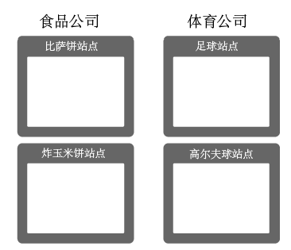
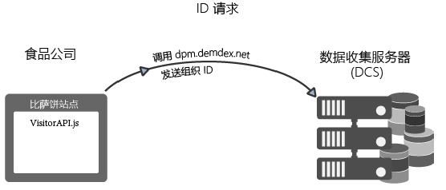
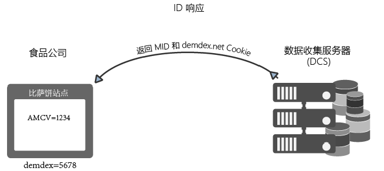
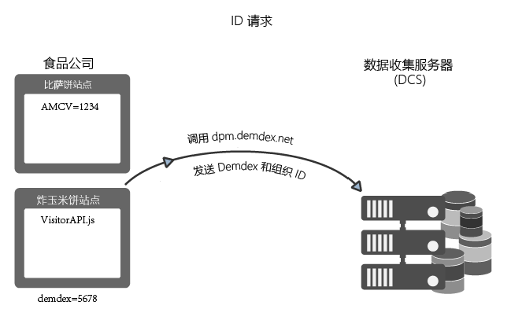
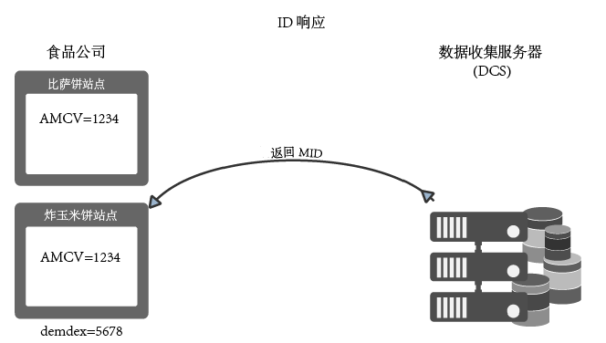
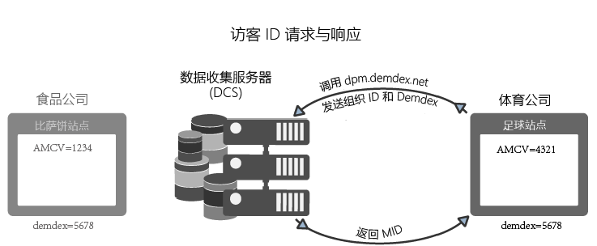

# Adobe访客ID服务如何请求和设置ID{#how-the-experience-cloud-id-service-requests-and-sets-ids}

ID 请求和响应过程概述。 这些示例涵盖了以下站点ID分配情况：单个站点上、不同站点之间，以及由具有自己IMS组织ID的不同CX Enterprise客户管理的站点。

>[!NOTE]
>
>如果您不熟悉访客ID服务如何创建访客ID，请花些时间查阅[Cookie和访客ID服务](../introduction/cookies.md)。

## 请求ECID {#section-0b5e261fbd0547d9b9a1680e5ce536cc}

以下示例演示了访客ID服务如何请求和接收ECID。 这些示例使用了两个虚构的公司（食品公司和体育公司）来演示 ID 请求和响应的数据流。 每个公司都有一个唯一的IMS组织ID，并已在其所有网站上实施了“访客ID服务”代码。 这些用例体现了通用访客ID服务实施的数据流，其中没有使用Analytics、旧版ID或阻止第三方Cookie的浏览器。

**第一次请求**

在此示例中，新访客来到由食品公司管理的比萨网站。 食品公司在比萨网站上具有访客ID服务代码。 加载比萨网站时，访客ID服务代码会检查比萨网站域中是否存在AMCV Cookie。

* 如果设置了AMCV Cookie，则网站访客将具有ECID。 在这种情况下，Cookie会跟踪访客并与其他CX Enterprise解决方案共享数据。
* 如果未设置AMCV Cookie，访客ID服务代码将调用位于`dpm.demdex.net/id`的区域[数据收集服务器](https://experienceleague.adobe.com/docs/analytics/technotes/rdc/regional-data-collection.html?lang=zh-Hans) (DCS)（另请参阅[了解Demdex域调用](https://experienceleague.adobe.com/docs/audience-manager/user-guide/reference/demdex-calls.html?lang=zh-Hans)）。 调用包括食品公司的IMS组织ID。 IMS组织ID是在访客ID服务代码的`Visitor.getInstance`函数中设置的。

**第一次响应**

在响应过程中，DCS会返回ECID和Demdex Cookie。 访客ID服务代码会将MID值写入AMCV Cookie。 例如，假设 DCS 返回 MID 值“1234”。 它就会在 AMCV Cookie 中存储为 `mid|1234`，并且将在第一方比萨饼域中设置。 Demdex Cookie 还包含一个唯一 ID（假设为 5678）。 此 Cookie 是在第三方 demdex.net 域中设置的，该域不同于披萨网站的域。

正如下一个示例所示，当我们的访客转到归食品公司所有的其他网站时，Demdex ID和IMS组织ID允许访客ID服务创建并返回正确的MID。

## 跨站点请求和响应 {#section-15ea880453af467abd2874b8b4ed6ee9}

在此示例中，我们的食品公司访客从比萨网站导航到墨西哥玉米卷网站。 食品公司在墨西哥玉米卷网站上提供了访客ID服务代码。 访客之前从未访问过墨西哥玉米卷网站。

鉴于上述情况，墨西哥玉米卷网站上没有 AMCV Cookie。 而且，访客ID服务不能使用在比萨网站上设置的AMCV Cookie，因为它特定于比萨饼域。 因此，访客ID服务必须调用DCS来检查并请求访客ID。 在这种情况下，DCS调用将包括食品公司的IMS组织ID *和* Demdex ID。 请记住，Demdex ID 是从比萨网站中提取的，并作为第三方 Cookie 存储在 demdex.net 域下。

在DCS收到IMS组织ID和Demdex ID后，它会为我们的站点访客创建并返回正确的MID。 由于是根据IMS组织ID和Demdex ID通过数学方法计算得到的，因此AMCV Cookie包含MID值`mid = 1234`。

## 来自其他网站的 ID 请求 {#section-ba9a929e50d64b0aba080630fd83b6f1}

在此示例中，我们的访客离开食品公司网站并导航到体育公司所拥有的足球网站。 当访客来到足球网站时，ID 检查和请求过程与前面示例中所述的过程相同。 但是，由于体育公司具有自己的IMS组织ID，因此访客ID服务会返回不同的MID。 新MID在由体育公司控制的域中是唯一的，它允许该公司跨CX Enterprise中的解决方案跟踪和共享访客数据。 此访客的 Demdex ID 保持不变，因为它包含在第三方 Cookie 中，在其他域中仍然有效。

