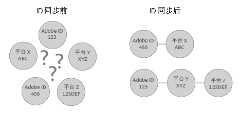

# 了解 ID 同步和匹配率 {#understanding-id-synchronization-and-match-rates}

关于 Experience Cloud Identity 服务（包括 Adobe Media Optimizer 和 ID 服务）中 ID 同步流程和匹配率的概述。

## ID 同步和匹配率 {#section-f652aae7234945e89d26dd833c5215fb}

ID 同步会将由 ID 服务分配的 ID 匹配到由我们的客户分配给其网站访客的 ID。例如，假设 ID 服务分配了访客 ID 1234。另一个平台则通过 ID 4321 来识别此访客。ID 服务会在同步过程中将这两个 ID 映射到一起。这样产生的结果是我们的客户可以通过新的数据点来了解其网站访客。此外，如果 ID 服务无法匹配某个 ID，它将创建一个新 ID，并使用该 ID 进行之后的同步。

匹配率用于衡量和验证 ID 同步过程的有效性。高匹配率意味着特定服务将比低匹配率的服务更有效，并且可接触到更多在线受众。比较匹配率是评估各个集成式广告技术平台的一种可量化方法。

**确保高匹配率**

要生成高匹配率，请务必正确设置 ID 服务（请参阅[标准实施指南](../implementation-guides/standard.md#concept-89cd0199a9634fc48644f2d61e3d2445)）。正确的实施有助于确保高匹配率，因为正确的实施可使 ID 服务能够设置正常运行所需的 Cookie，并与启用的数据合作伙伴同步 ID。但是，很多因素（例如 Internet 连接速度慢、从移动设备或无线网络收集数据）都可能会影响 ID 服务收集、同步和匹配 ID 的有效性。这些客户端变量超出了 ID 服务或 [!DNL Adobe] 的控制。

## 已描述的 ID 同步过程 {#section-a541a85cbbc74f5682824b1a2ee2a657}

ID 服务可实时同步 ID。此过程在浏览器中进行，而不是通过服务器到服务器数据传输进行。下表介绍了 ID 同步过程中的各个步骤。

**步骤 1：加载页面**

当访客访问您的网站并加载页面时，`Visitor.getInstance` 函数会向 ID 服务发起 [CORS](../reference/cors.md#concept-6c280446990d46d88ba9da15d2dcc758) 或 JSON-P 调用。ID 服务将回复一个包含访客 [!DNL Experience Cloud] ID (MID) 的 Cookie。此 MID 是分配给每个网站访客的唯一 ID。另请参阅 [Cookie 和 Experience Cloud Identity 服务](../introduction/cookies.md)。

**步骤 2：加载 iFrame**

加载页面主体时，ID 服务会加载一个名为 *`Destination Publishing iFrame`* 的 iFrame。[!UICONTROL Destination Publishing iFrame] 会在一个不同于父页面的域中加载。此设计有助于确保页面性能并提高安全性，因为该 iFrame 具有以下特点：

* 可与父页面异步加载。这意味着父页面可以独立于 [!UICONTROL Destination Publishing iFrame] 进行加载。加载 iFrame 以及从 iFrame 中加载 ID 同步像素不会影响父页面或用户体验。
* 可尽快加载。如果速度太快，您可以在窗口加载事件后加载 iFrame（不推荐）。有关详细信息，请参阅 [idSyncAttachIframeOnWindowLoad](../library/function-vars/idsyncattachiframeonwindowload.md#reference-b86b7112e0814a4c82c4e24c158508f4)。
* 可防止 iFrame 中的代码访问或影响父页面。

另请参阅 [Experience Cloud Identity 服务如何请求和设置 ID...](../introduction/id-request.md#concept-2caacebb1d244402816760e9b8bcef6a)。

**步骤 3：触发 ID 同步**

ID 同步过程是在 Destination Publishing iFrame 中触发 URL 的过程。正如该一般示例所示，ID 同步 URL 包含合作伙伴的 ID 同步端点和重定向 URL，后者是一个可返回到 [!DNL Adobe] 的重定向，其中还包含它们的 ID。

`http://abc.com?partner_id=abc&sync_id=123&redir=http://dpm.demdex.net/ibs:dpid=<ADOBE_PARTNER_ID>&dpuuid=<PARTNER_UUID>`

另请参阅[用于入站数据传输的 ID 同步](https://docs.adobe.com/content/help/zh-Hans/audience-manager/user-guide/implementation-integration-guides/sending-audience-data/batch-data-transfer-process/id-sync-http.html)。

**步骤 4：存储 ID**

同步的 ID 将存储在[边缘和核心数据服务器](https://docs.adobe.com/content/help/zh-Hans/audience-manager/user-guide/reference/system-components/components-edge.html)上。

## 同步服务管理 ID 同步 {#section-cd5784d7ad404a24aa28ad4816a0119a}

术语 *`Sync Services`* 指的是负责 ID 同步的内部 [!DNL Experience Cloud] 技术。默认情况下，此服务处于启用状态。要禁用此服务，请将一个[可选变量](../library/function-vars/disableidsync.md#reference-589d6b489ac64eddb5a7ff758945e414)添加到 ID 服务 `Visitor.getInstance` 函数中。同步服务可匹配不同的 [!DNL Experience Cloud] ID，例如：

* 将第三方 [!DNL Experience Cloud] Cookie ID 匹配到第一方 [!DNL Experience Cloud] ID。

* 将第一方 [!DNL Experience Cloud] Cookie ID 匹配到 [!DNL Adobe Media Optimizer] (AMO) ID。

* 将第三方 [!DNL Experience Cloud] Cookie ID 匹配到第三方数据提供程序和目标平台 ID。这包括各类服务和平台，例如数据提供程序、需求和/或供应端平台、广告网络、交换等。
* 将第一方 [!DNL Experience Cloud] Cookie ID 匹配到跨设备合作伙伴 ID。

## 与 Adobe Advertising Cloud 同步 ID {#section-642c885ea65d45ffb761f78838735016}

[!DNL Adobe Advertising Cloud]（之前称为 [!DNL Adobe Media Optimizer]）对于基于 iFrame 的 ID 同步过程是一个例外。由于 [!DNL Advertising Cloud] 是一个受信任的域，因此 ID 同步会从父页面中进行，而不是在 [!UICONTROL Destination Publishing iFrame] 中进行。在同步过程中，ID 服务会调用 [!DNL Advertising Cloud]（这是 `cm.eversttech.net` 在被 Adobe 收购之前所使用的旧版域名）中的 [!DNL Advertising Cloud]。将数据发送至 [!DNL Advertising Cloud] 有助于提高匹配率，对于使用版本 2.0（或更高版本）的 ID 服务客户而言，此数据发送过程是自动进行的。另请参阅 [Advertising Cloud Cookie](https://docs.adobe.com/content/help/zh-Hans/core-services/interface/ec-cookies/cookies-advertising-cloud.html)。

>[!MORELIKETHIS]
>
>* [了解 Demdex 域调用](https://docs.adobe.com/content/help/zh-Hans/audience-manager/user-guide/reference/demdex-calls.html)

