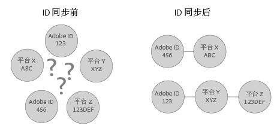

# 了解 ID 同步和匹配率{#understanding-id-synchronization-and-match-rates}

有关访客ID服务（包括Adobe Media Optimizer和访客ID服务）中ID同步流程和匹配率的概述。

## ID 同步和匹配率 {#section-f652aae7234945e89d26dd833c5215fb}

ID同步会将访客ID服务分配的ID匹配到客户分配给网站访客的ID。 例如，假设访客ID服务分配了访客ID 1234。 另一个平台则通过 ID 4321 来识别此访客。 访客ID服务会在同步过程中将这两个ID映射到一起。 这样产生的结果是我们的客户可以通过新的数据点来了解其网站访客。 此外，如果访客ID服务无法匹配某个ID，它将创建一个新ID，并使用该ID进行未来的同步。

匹配率用于衡量和验证 ID 同步过程的有效性。 高匹配率意味着特定服务将比低匹配率的服务更有效，并且可接触到更多在线受众。 比较匹配率是评估各个集成式广告技术平台的一种可量化方法。

**确保高匹配率**

正确的实施有助于确保高匹配率，因为正确的实施可让访客ID服务设置正常运行所需的Cookie，并将ID与启用的数据合作伙伴同步。 但是，Internet连接速度慢、从移动设备或无线网络收集数据等因素可能会影响访客ID服务收集、同步和匹配ID的有效性。 这些客户端变量不受访客ID服务或Adobe控制。

## ID 同步过程描述 {#section-a541a85cbbc74f5682824b1a2ee2a657}

访客ID服务可实时同步ID。 此过程在浏览器中进行，而不是通过服务器到服务器数据传输进行。 下表介绍了 ID 同步过程中的各个步骤。

**步骤 1：加载页面**

当访客访问您的网站并加载页面时，`Visitor.getInstance`函数会向访客ID服务发起[CORS](../reference/cors.md#concept-6c280446990d46d88ba9da15d2dcc758)或JSON-P调用。 访客ID服务将回复一个包含访客ECID的Cookie。 此 MID 是分配给每个网站访客的唯一 ID。 另请参阅[Cookie和访客ID服务](../introduction/cookies.md)。

**步骤 2：加载 iFrame**

加载页面正文时，访客ID服务会加载一个名为&#x200B;*`Destination Publishing iFrame`*&#x200B;的iFrame。 [!UICONTROL Destination Publishing iFrame] 在一个独立于父页面的域中加载。 此设计有助于确保页面性能并提高安全性，因为该 iFrame 具有以下特点：

* 可与父页面异步加载。 这意味着父页面可以独立于 [!UICONTROL Destination Publishing iFrame] 进行加载。 加载 iFrame 以及从 iFrame 中加载 ID 同步像素不会影响父页面或用户体验。
* 可尽快加载。 如果速度太快，您可以在窗口加载事件后加载 iFrame（不推荐）。 有关详细信息，请参阅 [idSyncAttachIframeOnWindowLoad](../library/function-vars/idsyncattachiframeonwindowload.md#reference-b86b7112e0814a4c82c4e24c158508f4)。
* 可防止 iFrame 中的代码访问或影响父页面。

另请参阅[访客ID服务如何请求和设置ID...](../introduction/id-request.md#concept-2caacebb1d244402816760e9b8bcef6a)。

**步骤 3：触发 ID 同步**

ID 同步过程是在 Destination Publishing iFrame 中触发 URL 的过程。 如该一般示例所示，ID同步URL包含合作伙伴的ID同步端点以及重定向URL，后者是返回到Adobe的重定向，其中还包含它们的ID。

`http://abc.com?partner_id=abc&sync_id=123&redir=http://dpm.demdex.net/ibs:dpid=<ADOBE_PARTNER_ID>&dpuuid=<PARTNER_UUID>`

另请参阅[用于入站数据传输的 ID 同步](https://experienceleague.adobe.com/docs/audience-manager/user-guide/implementation-integration-guides/sending-audience-data/batch-data-transfer-process/id-sync-http.html?lang=zh-Hans)。

**步骤 4：存储 ID**

同步的 ID 将存储在[边缘和核心数据服务器](https://experienceleague.adobe.com/docs/audience-manager/user-guide/reference/system-components/components-edge.html?lang=zh-Hans)上。

## 同步服务管理 ID 同步 {#section-cd5784d7ad404a24aa28ad4816a0119a}

术语&#x200B;*`Sync Services`*&#x200B;指的是负责ID同步的内部CX Enterprise技术。 默认情况下，此服务处于启用状态。 要禁用它，请将[可选变量](../library/function-vars/disableidsync.md#reference-589d6b489ac64eddb5a7ff758945e414)添加到访客ID服务`Visitor.getInstance`函数。 同步服务可匹配不同的ECID，例如：

* 第三方CX Enterprise Cookie ID到第一方ECID。

* 将第一方CX Enterprise Cookie ID匹配到Adobe Media Optimizer (AMO) ID。

* 将第三方CX Enterprise Cookie ID匹配到第三方数据提供商和目标平台ID。 这包括各类服务和平台，例如数据提供程序、需求和/或供应端平台、广告网络、交换等。
* 将第一方CX Enterprise Cookie ID匹配到跨设备合作伙伴ID。

## 与 Adobe Advertising Cloud 同步 ID {#section-642c885ea65d45ffb761f78838735016}

Adobe Advertising Cloud（以前称为Adobe Media Optimizer）对于基于iFrame的ID同步过程是一个例外。 由于Advertising Cloud是一个受信任的域，因此ID同步会从父页面中进行，而不是在[!UICONTROL Destination Publishing iFrame]中进行。 在同步过程中，访客ID服务调用位于`cm.eversttech.net`的Advertising Cloud，这是Advertising Cloud在被Adobe收购之前所使用的旧版域名。 将数据发送到Advertising Cloud有助于提高匹配率，对于使用版本2.0（或更高版本）的访客ID服务客户而言，此数据发送过程是自动进行的。 另请参阅 [Advertising Cloud Cookie](https://experienceleague.adobe.com/docs/core-services/interface/administration/ec-cookies/cookies-advertising-cloud.html?lang=zh-Hans)。

>[!MORELIKETHIS]
>
>* [了解 Demdex 域调用](https://experienceleague.adobe.com/docs/audience-manager/user-guide/reference/demdex-calls.html?lang=zh-Hans)

