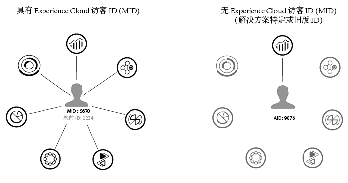

# 概述

Experience Cloud ID 服务允许将通用识别框架用于 Experience Cloud 核心服务、解决方案和客户属性，以及人员核心服务中的受众。它通过向网站访客分配一个唯一的永久性 ID 来工作。在您的组织实施 ID 服务后，您可以通过此 ID 在不同的 Experience Cloud 解决方案中识别同一网站访客及其数据。

此外，ID 服务还可替代特定于不同解决方案的 ID（例如 Analytics AID）。并且，通过[客户 ID 和身份验证状态](/help/reference/authenticated-state.md)功能，ID 服务允许您将自己的客户 ID 传递到 Experience Cloud。但是请记住，ID 服务只能在您已经订阅的解决方案中使用。它不提供对其他未注册产品的访问权限。

今后，ID 服务将成为许多当前和将来推出的 Experience Cloud 功能、增强功能和服务中的必备组件。目前，ID 服务支持 [Analytics](https://www.adobe.com/cn/analytics/adobe-analytics.html)、[Audience Manager](http://www.adobe.com/cn/marketing-cloud/data-management-platform.html) 和 [Target]( http://www.adobe.com/cn/marketing-cloud/testing-targeting.html)。另外，如果您要参与 Adobe Experience Cloud 设备协作，也需要使用该服务。如果您还没有实施 ID 服务，现在是时候开始考虑迁移策略了。有关 ID 服务的重要性和角色的更多信息，请参阅[为什么您应考虑使用 Experience Cloud ID 服务](http://blogs.adobe.com/digitalmarketing/analytics/why-new-adobe-marketing-cloud-id-service-should-be-on-your-radar/)。

## 功能摘要

概括来说，ID 服务具备以下功能：

* 创建可用于关联配置文件和身份的通用密钥或 ID。
* 在多个解决方案中对设备进行唯一标识。
* 在客户的域中设置第一方 Cookie 以确保进行同域跟踪。请参阅 Experience Cloud。
* 接收来自 Experience Cloud 客户和合作伙伴的别名和 ID 映射。
* 管理 Experience Cloud 内部的 ID 同步。
* 支持与广告技术生态系统中的不同第三方进行 ID 同步。

## ID 服务要求

在使用 ID 服务之前，您的解决方案和其他 Adobe 代码库必须符合[特定要求](/help/reference/requirements.md)。

* [Cookie 和 Experience Cloud ID 服务](cookies.md)：ID 服务使用您的组织 ID、Experience Cloud AMCV Cookie 和 Demdex Cookie，为您的网站访客创建并存储唯一的永久性标识符。这些 Cookie 允许 ID 服务跨不同的域跟踪访客，还允许在不同的 Experience Cloud 解决方案之间共享数据。
* [Experience Cloud ID 服务如何请求和设置 ID](id-request.md)：ID 请求和响应过程的概述。下面的示例涵盖了各种网站类型中的 ID 分配情况：单独的网站上、不同的网站之间，以及由 Experience Cloud 不同客户使用其各自组织 ID 管理的网站。
* [了解 ID 同步和匹配率](match-rates.md)：关于 Experience Cloud ID 服务（包括 Adobe Media Optimizer 和 ID 服务）中 ID 同步流程和匹配率的概述。