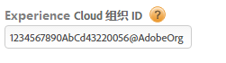
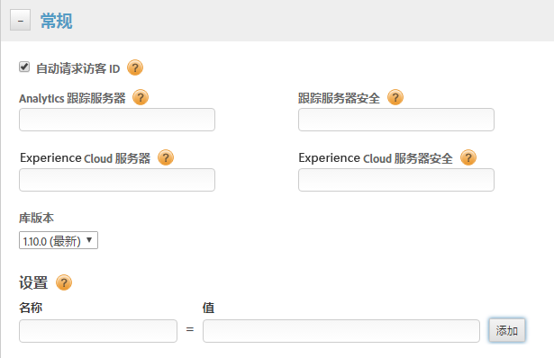
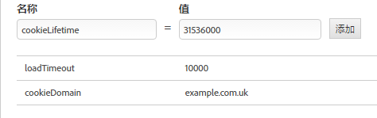
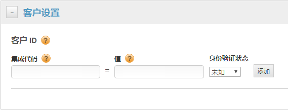
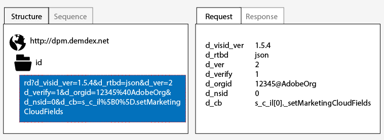

# 使用动态标签管理实现{#implementation-with-dynamic-tag-management}

旧版实施使用动态标签管理 (DTM) 来设置和部署 Experience Cloud ID 服务，并将其与您的其他 Experience Cloud 解决方案相集成。

## 使用动态标签管理实现 {#topic-6f4ed5d96977406ca991e50f3fbd5b01}

旧版实施使用动态标签管理 (DTM) 来设置和部署 Experience Cloud ID 服务，并将其与您的其他 Experience Cloud 解决方案相集成。

>[!NOTE]
>
>目前， [Launch by Adobe](https://docs.adobelaunch.com/) 是首选和推荐的实施工具，因为它有助于简化复杂的标签管理任务，并使代码位置超越DTM的功能。请参阅 [使用Launch实现](../mcvid-implementation-guides/ecid-implement-with-launch.md)。

## 动态标签管理和 ID 服务 {#section-4a4c4fac5d0a4cbbaff8e1833f73657c}

[通过动态标签管理](https://marketing.adobe.com/resources/help/en_US/dtm/) ，您可以配置、部署和管理ID服务实例和相关 [!DNL Experience Cloud] 的解决方案集成。DTM 可帮助简化实施流程，因为它与 ID 服务和其他 Experience Cloud 解决方案深度集成在一起。只需添加和配置 Experience Cloud ID 工具并指定相关信息即可，例如：

* Experience Cloud 组织 ID（如果关联到 Experience Cloud，则可自动填充）
* Analytics 跟踪服务器（安全和非安全）
* Experience Cloud 服务器（对应第一方跟踪服务器）

任何 [!DNL Experience Cloud] 客户都可以免费使用 DTM。

**DTM入门**

DTM 是一款简单而功能强大的工具。如果您尚未开始使用，我们强烈建议您使用该工具。请参阅 DTM [文档](https://marketing.adobe.com/resources/help/en_US/dtm/c_overview.html)和 [DTM 快速入门视频](https://marketing.adobe.com/resources/help/en_US/dtm/jump-start-videos.html)以了解如何开始使用此服务。有关如何使用 DTM 设置 ID 服务的说明，请参阅以下部分的信息和过程。

## 部署指南 {#concept-54a2ec49af8f4bfca9207b1d404e8e1a}

在尝试使用动态标签管理 (DTM) 实施 Experience Cloud ID 服务之前，请查看这些要求和程序。

<!--
mcvid-dtm-deployment.xml
-->

**提供您的帐户**

在开始之前，请确保您的组织和解决方案已为您 [!DNL Experience Cloud] 所熟悉而提供 [!DNL Dyanamic Tag Management]。以下文档可以帮助您快速入门：

* [为核心服务启用解决方案](https://marketing.adobe.com/resources/help/en_US/mcloud/core_services.html)：实施Experience Cloud并成为管理员。此过程可使您的核心服务（例如，客户属性和 Experience Cloud 受众）解决方案符合现代化要求。
* [动态标签管理使用入门](https://marketing.adobe.com/resources/help/en_US/dtm/get_started.html)
* [跳转开始视频](https://marketing.adobe.com/resources/help/en_US/dtm/jump-start-videos.html)：演示如何执行基本DTM任务的一系列简短视频。

**ID服务代码放置和加载顺序**

ID 服务是通过从 [!DNL Adobe] 数据收集服务器请求和接收唯一 ID 来工作的。要正常工作，您的 ID 服务代码必须：

* 是在页面上执行的第一个 [!DNL Adobe] 代码块。
* 尽可能在页面上放置尽可能高的位置，通常在 `<head>` 代码块内。

只要您在 DTM 中维护所有 [!DNL Adobe] 解决方案和代码库，它就会确保 ID 服务代码放置在正确的位置，并在合适时间触发。

**验证区域数据收集**

客户必须提供一个CNAME或用于 [!DNL *.sc.omtrdc][区域数据收集](https://marketing.adobe.com/resources/help/en_US/whitepapers/rdc/) (RDC)。请从您的 [!DNL Adobe] 顾问处获取具体的 RDC 设置。

**配置Analytics报告套件**

新 [!DNL Analytics] 客户应该[创建报表包](https://marketing.adobe.com/resources/help/en_US/reference/new_report_suite.html)，以便进行数据收集。

## 使用 DTM 实施 Experience Cloud ID 服务 {#task-a659cf19dea84ad48edabe0b72ef9f5c}

遵循以下步骤使用动态标签管理 (DTM) 实施 ID 服务。

**先决条件**

* 启用您的 [!DNL Experience Cloud] 解决方案，并确认您拥有管理员权限。请参阅 [启用核心服务解决方案](https://marketing.adobe.com/resources/help/en_US/mcloud/core_services.html)。

* 在 DTM 中创建 Web 属性。请参阅 DTM [创建 Web 属性](https://marketing.adobe.com/resources/help/en_US/dtm/web_property.html)文档或[管理员快速入门视频](https://marketing.adobe.com/resources/help/en_US/dtm/admin-jump-start.html)。

<!--
mcvid-dtm-implement.xml
-->

**实施步骤** 通过DTM实施ID服务：

1. 在DTM [!DNL Dashboard]中，单击要处理的Web属性。
1. 在选定Web资产 **[!UICONTROL 的概述]** 选项卡中，单击 **[!UICONTROL 添加工具]**。
1. 在 **[!UICONTROL 工具类型]** 列表中，单击 **[!UICONTROL Experience Cloud ID服务]**。

   >[!NOTE]
   >
   >此操作使用您的组织ID填充 **[!UICONTROL Experience Cloud组织ID]** 框。如果您的 DTM 帐户尚未与 [!DNL Experience Cloud] 关联，则需要提供此 ID。要关联您的帐户，请参阅[在 Experience Cloud 中关联帐户](https://marketing.adobe.com/resources/help/en_US/mcloud/organizations.html)。请参阅[要求](../mcvid-reference/mcvid-requirements.md#section-a02f537129a64ffbb690d5738d360c26)以了解关于如何查找组织 ID 的信息。

1. 在 **[!UICONTROL “跟踪服务器]** ”框中键入跟踪服务器的名称。如果您不确定如何找到跟踪服务器，请参阅 [常见问题解答](../mcvid-faq-intro/mcvid-faq.md) 并 [正确填充trackingServer和trackingServerSecure变量](https://helpx.adobe.com/analytics/kb/determining-data-center.html#)。
1. 单击 **[!UICONTROL 创建工具]** 和 **[!UICONTROL 保存更改]**。

   保存更改后，ID 服务在 DTM 中会被设置为一个工具。但您还无法使用该服务。您的 DTM 工具仍然需要完成 DTM 发布/审批流程，您可能还需要配置其他参数。有关 DTM 审批流程的信息，请观看[用户基本知识快速入门](https://marketing.adobe.com/resources/help/en_US/dtm/user-basics-jump-start.html)视频。有关可以添加到 DTM 的其他参数的信息，请参阅 [DTM 的 Experience Cloud ID 服务设置](../mcvid-implementation-guides/mcvid-standard.md#concept-fb6cb6a0e6cc4f10b92371f8671f6b59).

>[!MORE_ LIKE_ This]
>
>* [Web 属性](https://marketing.adobe.com/resources/help/en_US/dtm/web_property.html)


## DTM 的 Experience Cloud ID 服务设置 {#concept-fb6cb6a0e6cc4f10b92371f8671f6b59}

描述ID和 [!DNL Organization ID][!DNL General][!DNL Customer Settings] 字段以及它们如何被 [!DNL Experience Cloud] ID服务使用。

<!--
mcvid-dtm-settings.xml
-->

## 如何找到这些设置？ {#section-c5b2d1c928944ae2b8565c1b182fe575}

在动态标签管理 (DTM) 中作为工具添加 ID 服务并进行保存后，即可使用这些设置。您还可以通过单击DTM Web属性 [!DNL Installed Tools] 部分中的齿轮图标来访问这些设置。


## 组织 ID {#section-949b5a0d8af940558b04ff675cf53f77}

这是配置的 [!DNL Experience Cloud] 公司需要并与之关联的 ID。组织是一个实体，它允许管理员配置用户和群组，并控制 [!DNL Experience Cloud] 中的单点登录访问。组织 ID 是由 24 个字符组成的字母数字字符串，其后跟（且必须包括）@AdobeOrg。[!DNL Experience Cloud] 管理员可在 [Experience Cloud &gt; 工具](https://marketing.adobe.com/resources/help/en_US/mcloud/admin_getting_started.html)中找到此 ID。



另请参阅 [Cookie和Experience Cloud ID服务](../mcvid-introduction/mcvid-cookies.md)。

## 常规设置 {#section-071d358e40f84629a8901b893dd61392}

您可以通过这些设置指定跟踪服务器、代码版本和添加其他变量。



下表列出并定义 [!DNL General] 了设置。

**自动请求访客 ID**

选中后，动态标签管理将在加载使用Experience Cloud ID服务的任何Adobe解决方案之前自动调用 `getMarketingCloudVisitorID()` 该方法。

请参阅 [getMarketingCloudVisitorID](../mcvid-library/mcvid-get-set/mcvid-getmcvid.md)。

**Analytics 跟踪服务器**

用于 Analytics 数据收集的跟踪服务器的名称。这是写入图像请求和 Cookie 的域（例如 [!DNL http://site.omtrdc.net]）。

如果您不知道跟踪服务器URL，请检查您 `s_code.js` 的或 `AppMeasurement.js` 文件。您将需要由 `s.trackingServer` 变量设置的 URL。

请参阅 [trackingServer](https://marketing.adobe.com/resources/help/en_US/sc/implement/trackingServer.html) 以及[正确填充 trackingServer 和 trackingServerSecure 变量](https://helpx.adobe.com/analytics/kb/determining-data-center.html#)。

**跟踪服务器安全**

用于 Analytics 数据收集的安全跟踪服务器的名称。这是写入图像请求和 Cookie 的域（例如 [!DNL https://site.omtrdc.net]）。

如果您不知道跟踪服务器URL，请检查您 `s_code.js` 的或 `AppMeasurement.js` 文件。您将需要由 `s.trackingServerSecure` 变量设置的 URL。

请参阅 [trackingServer](https://marketing.adobe.com/resources/help/en_US/sc/implement/trackingServer.html) 以及[正确填充 trackingServer 和 trackingServerSecure 变量](https://helpx.adobe.com/analytics/kb/determining-data-center.html#)。

**Experience Cloud 服务器**

如果您的公司使用第一方数据收集 (CNAME) 来在第三方上下文中利用第一方 Cookie，请在此处输入跟踪服务器（例如 [!DNL http://metrics.company.com]。）

**Experience Cloud 服务器安全**

如果您的公司使用第一方数据收集 (CNAME) 来在第三方上下文中利用第一方 Cookie，请在此处输入跟踪服务器（例如 [!DNL https://metrics.company.com]。）

**库版本**

设置您想要使用的 ID 服务代码库 (`VisitorAPI.js`) 的版本。您无法编辑这些菜单选项。

**设置**

您可以通过这些字段作为键值对添加[函数变量](../mcvid-library/mcvid-function-vars/mcvid-function-vars.md)。单击 **[!UICONTROL 添加]可向您的 ID 服务实施添加一个或多个变量。**



>[!IMPORTANT]
>
>在此处设置 `cookieDomain` 变量。对于 URL 最后 2 个部分中任一部分多于两个字符的多部分顶级域而言，此变量是必需的。请参阅上述链接的“配置变量”文档。

## 客户设置 {#section-238d1272c1504d148fe38fb0ae5d71c2}

可让您添加集成代码或身份验证状态的其他字段。



**集成代码**

集成代码是客户提供的唯一 ID。集成代码应包含您用于在 [ 中](https://marketing.adobe.com/resources/help/en_US/aam/create-datasource.html)创建数据源[!DNL Audience Manager]的值。

**值**

值应该为包含用户 ID 的数据元素。数据元素是动态值的适用容器，例如来自特定客户端的内部系统的 ID。

**身份验证状态**

根据访客的身份验证状态（例如登录和注销）定义或识别访客的选项。请参阅 [客户ID和身份验证状态](../mcvid-reference/mcvid-authenticated-state.md)。

## 测试和验证Experience Cloud ID服务 {#concept-644fdbef433b46ba9c0634ac95eaa680}

这些说明、工具和过程可帮助您确定 ID 服务是否正常运行。这些测试通常适用于 ID 服务，也适用于不同的 ID 服务和 [!DNL Experience Cloud] 解决方案组合。

<!--
mcvid-test-verify.xml
-->

## 开始之前 {#section-b1e76ad552ed4eb793b6e521a55127d4}

在开始测试和验证ID服务之前需要了解的重要信息。

**浏览器环境**

在普通浏览器会话中进行测试时，请在每次测试之前清除您的浏览器缓存。

或者，您也可在匿名或使用假名的浏览器会话中测试 ID 服务。在匿名会话中，您无需在每次测试之前清除浏览器 Cookie 或缓存。

**工具**

[Adobe 调试器](https://marketing.adobe.com/resources/help/en_US/sc/implement/debugger.html)和 [Charles HTTP 代理](https://www.charlesproxy.com/)可帮助您确定 ID 服务是否已配置为可在 Analytics 中正常使用。此部分中的信息基于 Adobe 调试器工具和 Charles 代理返回的结果。当然，您也可以随意使用最适合您的任何工具或调试器。

## 通过 Adobe 调试器工具进行测试 {#section-861365abc24b498e925b3837ea81d469}

当您在调试器响应中看到(MID)时 [!DNL Experience Cloud ID] ，您的服务集成将 [!DNL Adobe] 正确配置。有关MID的更多信息，请参阅 [Cookie和Experience Cloud ID服务](../mcvid-introduction/mcvid-cookies.md) 。

要使用 [!DNL Adobe][调试器验证ID服务的状态](https://marketing.adobe.com/resources/help/en_US/sc/implement/debugger.html)，请执行以下操作：

1. 清除您的浏览器 Cookie，或打开匿名的浏览会话。
1. 加载包含 ID 服务代码的测试页面。
1. 打开 [!DNL Adobe] 调试器。
1. 在结果中检查 MID。

## 了解Adobe调试器结果 {#section-bd2caa6643d54d41a476d747b41e7e25}

MID存储在使用此语法的键值对中： `MID= *`Experience Cloud ID`*`。调试器将显示此信息，如下所示。

**成功**

如果您看到一个类似于如下形式的响应，则表明 ID 服务已成功实施：

```
mid=20265673158980419722735089753036633573
```

如果您是 [!DNL Analytics] 客户，除 MID 以外，可能还会看到 [!DNL Analytics] ID (AID)。它发生于以下情况：

* 对于您的某些早期/长期网站访客。
* 如果您启用了宽限期。

**失败**

如果调试器出现以下问题，请联系[客户关怀](https://helpx.adobe.com/marketing-cloud/contact-support.html)：

* 不返回 MID。
* 返回错误消息，指示尚未配置您的合作伙伴 ID。

## 使用Charles HTTP代理进行测试 {#section-d9e91f24984146b2b527fe059d7c9355}

要通过 Charles 验证 ID 服务的状态，请执行以下操作：

1. 清除您的浏览器 Cookie，或打开匿名的浏览会话。
1. 启动 Charles。
1. 加载包含 ID 服务代码的测试页面。
1. 检查下述请求和响应调用与数据。

## 了解Charles结果 {#section-c10c3dc0bb9945cbaffcf6fec7082fab}

有关查看位置、搜寻对象以及何时使用 Charles 监视 HTTP 调用的信息，请参阅此部分。

**Charles中的成功ID服务请求**

当 `Visitor.getInstance` 函数对 `dpm.demdex.net` 进行 JavaScript 调用时，您的 ID 服务代码工作正常。成功的请求包含您的[组织 ID](../mcvid-reference/mcvid-requirements.md#section-a02f537129a64ffbb690d5738d360c26)。组织ID作为使用此语法的键值对进行传递： `d_orgid= *`organization ID`*`。在 `dpm.demdex.net`[!DNL Structure] 选项卡下查找JavaScript调用。在 [!DNL Request] 选项卡下查找您的组织ID。



**Charles中成功的ID服务响应**

当来自[数据收集服务器](https://marketing.adobe.com/resources/help/en_US/aam/c_compcollect.html) (DCS) 的响应返回 MID 时，您的帐户已正确配置。MID将作为使用此语法的键值对返回： `d_mid: *`访客Experience Cloud ID`*`。在 [!DNL Response] 选项卡中查找MID，如下所示。


**Charles中的失败ID服务响应**

如果 DCS 响应中缺失 MID，则表示您的帐户未正确配置。失败的响应会在 [!DNL Response] 选项卡中返回错误代码和消息，如下所示。如果您在 DCS 响应中看到此错误消息，请联系客户关怀。


有关错误代码的更多信息，请参阅 [DCS 错误代码、消息和示例](https://marketing.adobe.com/resources/help/en_US/aam/dcs_error_codes.html)。
