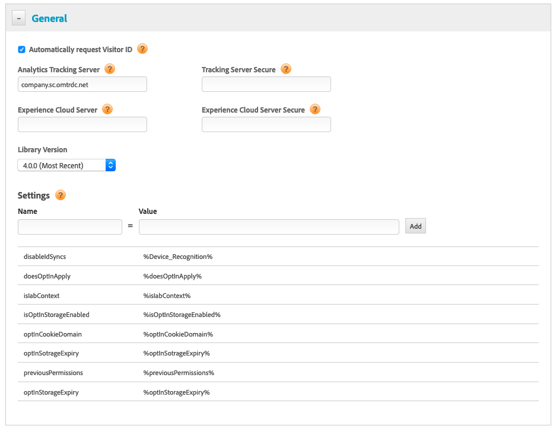

# 使用 DTM 配置选择加入{#configuring-opt-in-with-dtm}

使用 Dynamic Tag Management (DTM) 启用选择加入服务。

使用 DTM 设置选择加入服务。

必需:

* 升级到 ECID 4.0.0 或更高版本。请参阅 [ECID 下载](https://github.com/Adobe-Marketing-Cloud/id-service/releases)。

在“常规 DTM”页面中输入[配置字段](https://marketing.adobe.com/resources/help/zh_CN/mcvid/api.html)。

