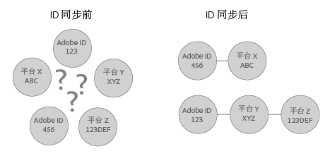

# 了解 ID 同步和匹配率 {#understanding-id-synchronization-and-match-rates}

关于 Experience Cloud ID 服务（包括 Adobe Media Optimizer 和 ID 服务）中 ID 同步流程和匹配率的概述。

## ID 同步和匹配率 {#section-f652aae7234945e89d26dd833c5215fb}

ID 同步将 ID 服务分配的 ID 与由我们客户分配给网站访客的 ID 进行匹配。例如，ID 服务分配了一个访客 ID 1234。另一个平台通过 ID 4321 认识此访客。ID 服务在同步过程中一起映射这些 ID。这些结果会不断增加我们客户对与其站点访客相关的新数据点的了解。如果 ID 服务无法匹配 ID，它会创建一个新 ID 并将该 ID 用于将来的同步。

匹配率可测量并验证 ID 同步过程的功效。高匹配率表示某个特定的服务将具有较高的功效，并与匹配率较低的服务相比，可提供对更大联机受众的访问。比较匹配率是一种量化方式，可用于评估不同的集成广告技术平台。



**确保高匹配率**

要生成高匹配率，请务必正确设置 ID 服务（请参阅[标准实施指南](../mcvid-implementation-guides/mcvid-standard.md#concept-89cd0199a9634fc48644f2d61e3d2445)）。适当的实施有助于确保高匹配率，因为这种实施会让 ID 服务来设置它正常工作及与已启用数据合作伙伴同步 ID 所需的 Cookie。但是，有些因素可能会影响 ID 服务收集、同步和匹配 ID 的效率，如 Internet 连接速度缓慢、收集数据来自移动设备或无线网络。这些客户端变量超出了 ID 服务或 [!DNL Adobe] 的控制。

## 已描述的 ID 同步过程 {#section-a541a85cbbc74f5682824b1a2ee2a657}

ID 服务实时同步 ID。此过程在浏览器中进行，而不是通过服务器到服务器的数据传输进行。下表描述了 ID 同步过程中的步骤。

**步骤 1：加载页面**

当访客访问您的网站并加载页面时，`Visitor.getInstance` 函数会向 ID 服务发起 [CORS](../mcvid-reference/mcvid-cors.md#concept-6c280446990d46d88ba9da15d2dcc758) 或 JSON-P 调用。ID 服务将回复一个包含访客 [!DNL Experience Cloud] ID (MID) 的 Cookie。此 MID 是分配给每个网站访客的唯一 ID。另请参阅 [Cookie 和 Experience Cloud ID 服务](../mcvid-introduction/mcvid-cookies.md).

**步骤 2：加载 iFrame**

在页体加载时，ID 服务会加载一个名为 *`Destination Publishing iFrame`* 的 iFrame。[!DNL Destination Publishing iFrame] 在一个独立于父页面的域中加载。此设计有助于确保页面性能并提高安全性，因为此 iFrame 可以：

* 相对于父页面异步加载。这意味着父页面可以独立于 [!DNL Destination Publishing iFrame] 进行加载。加载 iFrame 并从 iFrame 之内加载 ID 同步像素不会影响父页面或用户体验。
* 尽可能快地加载。如果它加载得过快，您可以在窗口加载事件之后加载 iFrame（不推荐）。请参阅[idSyncAttachIframeOnWindowLoad](../mcvid-library/mcvid-function-vars/mcvid-idsyncattachiframeonwindowload.md#reference-b86b7112e0814a4c82c4e24c158508f4)，以了解详细信息。
* 阻止 iFrame 中的代码获取父页面的访问权限或影响父页面。

另请参阅 [Experience Cloud ID 服务如何请求和设置 ID...](../mcvid-introduction/mcvid-id-request.md#concept-2caacebb1d244402816760e9b8bcef6a).

**步骤 3：触发 ID 同步**

ID 同步是一个在目标发布 iFrame 中触发的 URL。正如该一般示例所示，ID 同步 URL 包含合作伙伴的 ID 同步端点和重定向 URL，后者是一个可返回到 [!DNL Adobe] 的重定向，其中还包含它们的 ID。

```
http://abc.com?partner_id=abc&sync_id=123&redir=http://dpm.demdex.net/ibs:dpid=<
<varname>
  ADOBE_PARTNER_ID
</varname>>&dpuuid=<
<varname>
  PARTNER_UUID
</varname>>
```

另请参阅[入站数据传输的 ID 同步](https://marketing.adobe.com/resources/help/zh_CN/aam/c_id_sync_in.html)。

**步骤 4：存储 ID**

同步 ID 存储在[边缘和核心数据服务器](servershttps://marketing.adobe.com/resources/help/zh_CN/aam/c_compedge.html)中。

## 同步服务管理 ID 同步 {#section-cd5784d7ad404a24aa28ad4816a0119a}

术语 *`Sync Services`* 指的是负责 ID 同步的内部 [!DNL Experience Cloud] 技术。此服务在默认情况下处于启用状态。要禁用此服务，请将一个[可选变量](../mcvid-library/mcvid-function-vars/mcvid-disableidsync.md#reference-589d6b489ac64eddb5a7ff758945e414)添加到 ID 服务 `Visitor.getInstance` 函数。同步服务可匹配不同的 [!DNL Experience Cloud] ID，例如：

* 将第三方 [!DNL Experience Cloud] Cookie ID 匹配到第一方 [!DNL Experience Cloud] ID。

* 将第一方 [!DNL Experience Cloud] Cookie ID 匹配到 [!DNL Adobe Media Optimizer] (AMO) ID。

* 将第三方 [!DNL Experience Cloud] Cookie ID 匹配到第三方数据提供程序和目标平台 ID。这包括各类服务和平台，例如数据提供程序、需求和/或供应端平台、广告网络、交换等。
* 将第一方 [!DNL Experience Cloud] Cookie ID 匹配到跨设备合作伙伴 ID。

## 与 Adobe Media Optimizer 之间的 ID 同步 {#section-642c885ea65d45ffb761f78838735016}

[!DNL Adobe Media Optimizer] 对基于 iFrame 的 ID 同步过程是一个例外。由于 [!DNL Media Optimizer] 是一个受信任的域，因此 ID 同步会在父页面中进行，而不是在 [!DNL Destination Publishing iFrame] 中进行。在同步过程中，ID 服务会调用 [!DNL Media Optimizer]（这是 `cm.eversttech.net` 在被 Adobe 收购之前所使用的旧版域名）中的 [!DNL Media Optimizer]。将数据发送至 [!DNL Media Optimizer] 有助于提高匹配率，对于使用版本 2.0（或更高版本）的 ID 服务客户而言，此数据发送过程是自动进行的。另请参阅 [Media Optimizer Cookie](https://marketing.adobe.com/resources/help/zh_CN/whitepapers/cookies/cookies_media_optimizer.html)。

>[!MORE_LIKE_THIS]
>
>* [了解 Demdex 域调用](https://marketing.adobe.com/resources/help/zh_CN/aam/demdex-calls.html)。

