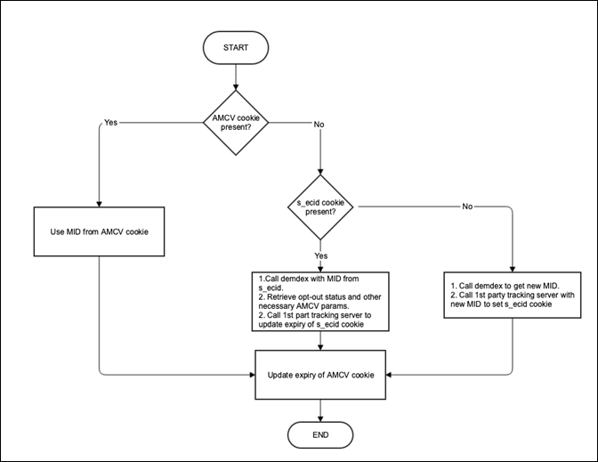

# Safari ITP 中的 ECID 库方法

由于 Safari 通过 ITP 加强了跨域跟踪，因此 Adobe 必须在支持客户的库以及消费者隐私和选择方面继续使用相应的最佳实践。

2019 年 2 月 21 日，Apple 宣布已将 ITP（智能跟踪预防）更新到最新版本。与之前侧重于第三方 Cookie 的版本不同，此版本详细介绍了适用于第一方 Cookie 的新跟踪预防措施。通过 document.Cookie API 设置的所有第一方持久性 Cookie（通常称为“客户端”Cookie）的有效期限为 7 天。系统将继续阻止第三方 Cookie，这一点在早期版本的 ITP 中已有声明。For more details on ITP 2.1 and the impact of Adobe solutions, read [Safari ITP 2.1 Impact on Adobe Experience Cloud and Experience Platform Customers](https://medium.com/adobetech/safari-itp-2-1-impact-on-adobe-experience-cloud-customers-9439cecb55ac).

## 适用于 Safari ITP 的 Adobe ECID 常见问题解答

**为什么由客户第一方域中 Experience Cloud ID 库 (ECID) 设置的 AMCV Cookie 会受到 ITP 2.1 的影响？**

AMCV Cookie 目前依赖于 document.Cookie API，并通过“客户端”进行设置。Safari 支持通过客户服务器设置的 Cookie。

**为什么通过 CNAME 跟踪服务器设置的 Cookie 更适合在 Safari 中实施跟踪？**

ITP 的规则侧重于将控制权交还给开发人员。仅通过 JavaScript 无法完成通过 CNAME 证书的实施。Adobe 的 CNAME 认证计划（服务器端跟踪）与 ITP 一致，多年来一直作为 Adobe 战略的一部分。ECID 库将发布侧重于将 ECID 库功能移至 CNAME 实施的方法。

**为什么当其他 Analytics 访客跟踪方法与 CNAME 结合使用时，Adobe 会重点使用 ECID 库？**

ECID 库、AMCV Cookie 和 ECID（又称为 MID）均可以将所有 Adobe 解决方案集成到一个 ID 下。此 ID 将继续是 Adobe 产品路线图中具有高优先级的 Cookie 级别 ID，并且是 Adobe Experience Platform 的默认 Cookie ID。

**CNAME 可以帮助客户启用多域跟踪吗？**

CNAME 以前已有的相同规则和警告现在仍然存在。在某些情况下，CNAME 有助于客户启用多域方案。如果您有一个主要的登录网站，可以在用户访问其他域之前识别用户，那么 CNAME 就可以在不接受第三方 Cookie 的浏览器中启用多域跟踪。尽管 CNAME 有助于启用某些多域方案，但是将 ECID 转换为 CNAME 实施的目的是为了获取持久访客识别，而不是多域跟踪。有关 CNAME 和多域的更多信息，请参阅[数据收集 CNAME 和跨域跟踪](/help/reference/analytics-reference/cname.md)。

由于已发布其他 ITP 更改，因此将在此处添加更多常见问题解答。For more inquiries, please visit [Adobe Experience League](https://experienceleague.adobe.com/#recommended/solutions/analytics).

## 与 ITP 相关的更改、方法和配置

由于已为 Safari 中的跟踪创建其他方法，因此，它们将被作为参考内容添加为此页面。

>[!NOTE] 在下面的所有文档中，*ECID* = *MID* = *MCID*。

请参阅下文，了解与 ITP 和 ECID 库使用相关的事项。

## 使用 ECID 库和 CNAME 跟踪来延长访客 ID 过期时间

ITP 2.1 会减弱写入客户端 Cookie 的能力，进而会削弱向客户提供准确访客跟踪信息的能力。因此，Adobe 将会对其 CNAME 跟踪服务器进行更改，以便将访客的 Experience Cloud ID (ECID) 存储在第一方 Cookie 中。

此更改仅对在第一方环境中使用 Analytics CNAME 的 ECID 客户有益。即使您是当前未使用 CNAME 的 Analytics 客户或者甚至不是 Analytics 客户，您仍可以查看 CNAME 记录。请联系客户关怀或您的客户代表以开始注册 [CNAME的过程](https://marketing.adobe.com/resources/help/en_US/whitepapers/first_party_cookies/adobe_managed_cert_pgm.html)。

升级到 ECID 库版本 4.3.0 及更高版本以利用此更改。

**设计**

向 demdex.net 发出 ID 请求并检索到 ECID 后，如果在您的 ECID 库中设置了跟踪服务器，则会向客户所在的域发出 ID 请求。此端点会从查询字符串中读取 ecid 参数，并设置一个新的 [Cookie](/help/introduction/cookies.md)，该 Cookie 将仅包含 ECID，并会在两年后过期。每次以这种方式调用此端点时，`s_ecid` Cookie 将进行重写，并且有效其为此调用开始后的两年。需要将 ECID 库更新到 v 4.3.0，以便可以检索此 Cookie 的值。

此新 `s_ecid` Cookie 采用与 AMCV Cookie 相同的选择退出状态。如果从 `s_ecid` Cookie 读取 ecid，则系统始终会立即调用 demdex 以检索该 ID 的最新选择退出状态并将其存储在 AMCV Cookie 中。

此外，如果您的消费者已经通过此方法退出了Analytics跟 [踪](https://marketing.adobe.com/resources/help/en_US/sc/implement/opt_out_link.html)，则此 `s_ecid` Cookie将被删除。

使用 trackingServer 或 trackingServerSecure 初始化库时，应将跟踪服务器名称提供给 VisitorJS 库。此操作应该与 Analytics 配置中的 trackingServer 配置匹配。

如果您选择不使用此方法，请将以下配置添加到您的 ECID 库实施中：discardtrackingServerECID。当此配置设置为 true 时，访客库不会读取第一方跟踪服务器设置的 MID。

## 使用 appendVisitorIDsTo 方法进行跨域跟踪（在您自己公司的多个域中）

通过此函数，在浏览器阻止第三方 Cookie 时，您可以跨域共享访客的 ECID。要使用此函数，您必须已实施 ID 服务，并且拥有源域和目标域。该函数可在 VisitorAPI.js 1.7.0 或更高版本中使用（但不可在 1.10.0 版本中使用）。

**设计**

* 当访客浏览您的其他域时，Visitor.appendVisitorIDsTo(url) 会返回一个 URL，其中包含作为查询参数附加的 ECID。

   使用此 URL 可以从原始域重定向到目标域。

* 目标域上的 ID 服务代码会从 URL 中提取 ECID，而不是向 Adobe 发送请求以获取该访客的 ID。

   此请求包含第三方 Cookie ID，而该 ID 在这种情况下不可用。

* 目标页面上的 ID 服务代码使用传入的 ECID 跟踪访客。

   >[!NOTE]
   >如果目标页面已经具有来自先前访问的 ECID，则此配置 overwriteCrossDomainMCIDAndAID 将控制是否覆盖现有 Cookie。有关此配置的详细信息，请参阅 [overwriteCrossDomainMCIDAndAID](/help/library/function-vars/overwrite-visitor-id.md)。
   >
   >有关此方法的更多详细信息，请参阅 [appendVisitorIDsTo（跨域跟踪）](/help/library/get-set/appendvisitorid.md)参考页。
